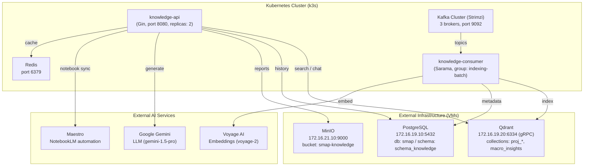
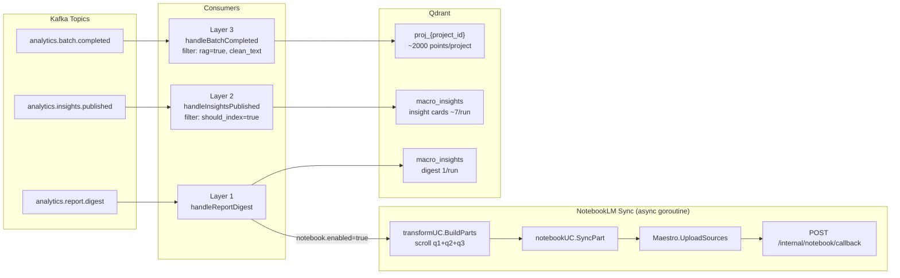
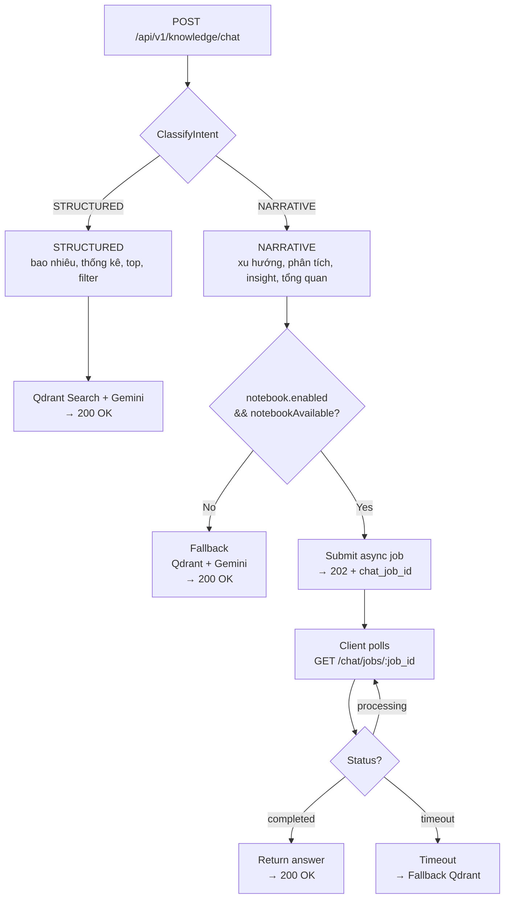

# SMAP Knowledge Service

Core service for SMAP platform handling RAG (Retrieval-Augmented Generation), Vector Search, Report Generation, Analytics Indexing, and NotebookLM Integration.

## Table of Contents

- [Architecture](#architecture)
- [Tech Stack](#tech-stack)
- [Features](#features)
- [Quick Start](#quick-start)
- [Configuration](#configuration)
- [Deployment](#deployment)
- [API Endpoints](#api-endpoints)
- [Project Structure](#project-structure)
- [Development](#development)
- [Documentation](#documentation)

---

## Architecture

### System Overview

Knowledge-srv implements a 3-layer indexing pipeline that processes analytics data from Kafka and indexes it into Qdrant vector database. The service also integrates with NotebookLM for advanced narrative analysis.



### 3-Layer Indexing Pipeline



**Data Flow:**

1. **Layer 3** (Raw Posts): Individual social media posts with sentiment, aspects, entities
2. **Layer 2** (Insights): Aggregated insights like "Cetaphil gained share of voice"
3. **Layer 1** (Digest): Campaign-level summary with top brands, topics, issues

**NotebookLM Trigger:**

When Layer 1 digest is received AND `notebook.enabled=true`:
- Async goroutine scrolls all 3 layers from Qdrant
- Builds markdown parts (digest + insights + high-impact posts)
- Syncs to NotebookLM via Maestro API
- Enables narrative chat queries with deeper context

### Chat Routing



**Examples:**

- STRUCTURED: "How many mentions of Cetaphil?", "Top 10 posts", "Filter by sentiment"
- NARRATIVE: "Analyze market trends", "What are key insights?", "Compare brands"

---

## Tech Stack

| Component  | Technology     | Purpose                            | Connection       |
| ---------- | -------------- | ---------------------------------- | ---------------- |
| Language   | Go 1.25+       | Backend                            | -                |
| Framework  | Gin            | HTTP routing                       | -                |
| Vector DB  | Qdrant         | High-performance vector search     | gRPC (port 6334) |
| Database   | PostgreSQL 15+ | Metadata, conversation history     | TCP (port 5432)  |
| Cache      | Redis 7+       | Caching search results, rate limit | TCP (port 6379)  |
| Queue      | Kafka          | Async ingestion and events         | TCP (port 9092)  |
| Storage    | MinIO          | Report storage (PDF/Markdown)      | HTTP (port 9000) |
| AI Model   | Google Gemini  | LLM for RAG and Reports            | HTTPS API        |
| Embedding  | Voyage AI      | High-quality text embeddings       | HTTPS API        |
| Automation | Maestro        | NotebookLM browser automation      | HTTPS API        |

---

## Features

- **Real-time Indexing**: Ingests analytics data from Kafka with 3-layer pipeline
- **Vector Search**: Semantic search with pre-filtering (sentiment, aspect, date) and caching
- **RAG Chat**: Context-aware Q&A with citation and smart suggestions
- **NotebookLM Integration**: Advanced narrative analysis with deeper context
- **Smart Routing**: Automatic query classification (structured vs narrative)
- **Async Reporting**: Generates deep-insight reports (Summary, Comparison, Trend)
- **Multi-layer Caching**: Optimizes performance for search and prompts
- **Hallucination Control**: Strict context checking before answering

---

## Quick Start

### Prerequisites

- Go 1.25+
- Docker & Docker Compose (optional for local deps)
- PostgreSQL 15+
- Qdrant 1.10+
- Redis 7+
- MinIO (S3 compatible)
- Kafka (required for consumer)

### 1. Clone & Configure

```bash
git clone <repository-url>
cd knowledge-srv

# Copy config template
cp config/knowledge-config.example.yaml config/knowledge-config.yaml

# Edit with your secrets (API Keys, DB Creds)
nano config/knowledge-config.yaml
```

### 2. Setup Database

```bash
# Create database
createdb smap

# Run migrations (creates schema 'schema_knowledge' and tables)
psql -h localhost -U postgres -d smap -f migrations/001_init.sql
# ... run all migration files in order
```

### 3. Configure AI Keys

1. Get **Voyage AI** Key: [Dash](https://dash.voyageai.com/)
2. Get **Google Gemini** Key: [AI Studio](https://aistudio.google.com/)
3. Update `config/knowledge-config.yaml`:

```yaml
voyage:
  api_key: "pa-..."

gemini:
  api_key: "AIza..."
  model: "gemini-1.5-pro"
```

### 4. Run Services

```bash
# Run API service
make run-api

# Run Consumer (in separate terminal)
make run-consumer
```

### 5. Test

```bash
# Health check
curl http://localhost:8080/health

# Test chat (requires indexed data)
curl -X POST http://localhost:8080/api/v1/knowledge/chat \
  -H "Content-Type: application/json" \
  -H "Authorization: Bearer <token>" \
  -d '{
    "project_id": "proj_id",
    "campaign_id": "campaign_id",
    "message": "What are the top brands?"
  }'
```

---

## Configuration

### Environment Variables

Key settings (can be set via env vars or `config/knowledge-config.yaml`):

```yaml
# Environment
environment:
  name: production # development | staging | production

# Vector DB (gRPC port 6334, REST API port 6333)
qdrant:
  host: 172.16.19.20
  port: 6334
  use_tls: false
  timeout: 30

# PostgreSQL
postgres:
  host: 172.16.19.10
  port: 5432
  dbname: smap
  schema: schema_knowledge # Important: Use 'schema_knowledge'
  user: knowledge_prod
  password: <from secret>

# Redis
redis:
  host: redis-client.infrastructure.svc.cluster.local
  port: 6379
  password: <from secret>

# Kafka
kafka:
  brokers:
    - kafka-cluster-kafka-bootstrap.kafka.svc.cluster.local:9092
  group_id: knowledge-consumer-group

# AI Services
voyage:
  api_key: <from secret>

gemini:
  api_key: <from secret>
  model: gemini-1.5-pro

# MinIO
minio:
  endpoint: 172.16.21.10:9000
  access_key: <from secret>
  secret_key: <from secret>
  bucket: smap-knowledge
  use_ssl: false

# NotebookLM (optional)
notebook:
  enabled: false # Set to true when Maestro is available
  max_posts_per_part: 50
  sync_max_retries: 3
  chat_timeout_sec: 45

maestro:
  base_url: https://maestro.example.com
  api_key: <from secret>
  webhook_callback_url: https://knowledge-api/internal/notebook/callback
  webhook_secret: <from secret>

# Router
router:
  default_backend: qdrant
  notebook_fallback_enabled: true
  intent_classifier: rules # rules | gemini_flash
```

### Kubernetes Deployment

See `manifests/` directory for Kubernetes resources:

```bash
# Setup config files from examples
./manifests/setup.sh

# Edit with your values
nano manifests/configmap.yaml
nano manifests/secret.yaml

# Apply to cluster
kubectl apply -f manifests/configmap.yaml
kubectl apply -f manifests/secret.yaml
kubectl apply -f manifests/
```

**Important**: `configmap.yaml` and `secret.yaml` are gitignored. Only `.example` files are tracked.

---

## API Endpoints

### Indexing Domain

- `POST /api/v1/indexing/manual` — Manual data ingestion
- `POST /api/v1/indexing/batch` — Batch ingestion

### Search Domain

- `POST /api/v1/search` — Vector search with filters
- `POST /api/v1/search/aggregate` — Get statistics (sentiment, platform, aspects)

### Chat Domain

- `POST /api/v1/chat` — Send message (RAG)
  - Returns 200 OK for structured queries (sync)
  - Returns 202 Accepted for narrative queries (async)
- `GET /api/v1/chat/jobs/:job_id` — Poll async chat job status
- `GET /api/v1/chat/history` — Get conversation history
- `GET /api/v1/chat/suggestions` — Get smart follow-up suggestions

### Report Domain

- `POST /api/v1/reports/generate` — Request report generation (Async)
- `GET /api/v1/reports/:id` — Get report status
- `GET /api/v1/reports/:id/download` — Download report file

### Internal Endpoints

- `POST /internal/notebook/callback` — Maestro webhook callback
- `GET /health` — Health check

---

## Project Structure

```
knowledge-srv/
├── cmd/
│   ├── api/              # Main API server
│   │   ├── main.go
│   │   ├── Dockerfile
│   │   └── deployment.yaml
│   └── consumer/         # Kafka consumer
│       ├── main.go
│       ├── Dockerfile
│       └── deployment.yaml
├── config/               # Configuration struct & yaml
│   ├── config.go
│   ├── knowledge-config.yaml (gitignored)
│   ├── knowledge-config.example.yaml
│   ├── kafka/
│   ├── qdrant/
│   ├── postgre/
│   ├── redis/
│   └── minio/
├── internal/
│   ├── indexing/         # Domain: Ingestion & Embedding
│   │   ├── usecase/
│   │   ├── delivery/
│   │   │   ├── http/
│   │   │   └── kafka/
│   │   └── repository/
│   ├── search/           # Domain: Retrieval & Aggregation
│   ├── chat/             # Domain: RAG & Conversation
│   ├── report/           # Domain: Report Generation
│   ├── point/            # Domain: Vector Point Management (Qdrant)
│   ├── embedding/        # Domain: Embedding Generation (Voyage)
│   ├── transform/        # Domain: NotebookLM Data Transform
│   ├── notebook/         # Domain: NotebookLM Sync & Chat
│   ├── httpserver/       # Router, wiring, middleware
│   ├── consumer/         # Consumer server setup
│   ├── model/            # Shared entities
│   └── middleware/       # Auth, CORS, logging
├── pkg/
│   ├── qdrant/           # Qdrant client wrapper (gRPC)
│   ├── gemini/           # Google Gemini client
│   ├── voyage/           # Voyage AI client
│   ├── minio/            # MinIO client
│   ├── kafka/            # Kafka wrappers
│   ├── maestro/          # Maestro API client
│   └── ...               # Utils
├── migrations/           # SQL schemas
├── manifests/            # Kubernetes manifests
│   ├── configmap.yaml (gitignored)
│   ├── secret.yaml (gitignored)
│   ├── configmap.yaml.example
│   ├── secret.yaml.example
│   ├── setup.sh
│   └── README.md
└── documents/            # Architecture & Plans
    ├── master-proposal.md
    ├── code_plans/
    ├── conventions/
    ├── notebook-migration/
    └── ops/
```

---

## Development

### Build & Run

```bash
# Run API locally
make run-api

# Run Consumer
make run-consumer

# Build Docker images
make docker-build-api
make docker-build-consumer

# Run tests
make test

# Generate code (if using code generation)
make generate
```

### Local Development with Docker Compose

```bash
# Start dependencies
docker-compose up -d postgres qdrant redis minio kafka

# Run services
make run-api
make run-consumer
```

### Debugging

```bash
# Check consumer logs
kubectl logs -n smap -l app=knowledge-consumer --tail=100 -f

# Check API logs
kubectl logs -n smap -l app=knowledge-api --tail=100 -f

# Check Kafka consumer group lag
kubectl exec -n kafka kafka-cluster-broker-0 -- \
  /opt/kafka/bin/kafka-consumer-groups.sh \
  --bootstrap-server localhost:9092 \
  --group knowledge-indexing-batch --describe
```

---

## Deployment

### Docker

```bash
# Build
docker build -t knowledge-srv:latest -f cmd/api/Dockerfile .

# Run
docker run -d -p 8080:8080 \
  -v $(pwd)/config:/app/config \
  knowledge-srv:latest
```

### Kubernetes

```bash
# Setup manifests
cd manifests
./setup.sh

# Edit config files
nano configmap.yaml
nano secret.yaml

# Deploy
kubectl apply -f configmap.yaml
kubectl apply -f secret.yaml
kubectl apply -f .

# Verify
kubectl get pods -n smap
kubectl logs -n smap -l app=knowledge-api
kubectl logs -n smap -l app=knowledge-consumer
```

### Monitoring

```bash
# Check service health
curl http://knowledge-api:8080/health

# Check Qdrant collections
curl http://172.16.19.20:6333/collections

# Check PostgreSQL
psql -h 172.16.19.10 -U knowledge_prod -d smap -c "SELECT COUNT(*) FROM schema_knowledge.nb_campaigns;"
```

---

## Documentation

### Architecture Documents

- [Master Proposal](documents/master-proposal.md) - Overall architecture
- [NotebookLM Architecture](documents/notebook-migration/architecture.md) - NotebookLM integration details
- [Staging Test Plan](documents/ops/stg-test-plan.md) - End-to-end testing guide

### Domain Plans

- [Domain 1: Indexing](documents/code_plans/domain_1_code_plan.md)
- [Domain 2: Search](documents/code_plans/domain_2_code_plan.md)
- [Domain 3: Chat](documents/code_plans/domain_3_code_plan.md)
- [Domain 4: Report](documents/code_plans/domain_4_code_plan.md)
- [Dynamic Smart Suggestions](documents/code_plans/dynamic_smart_suggestion_code_plan.md)

### Conventions

- [General Conventions](documents/conventions/convention.md)
- [Delivery Layer](documents/conventions/convention_delivery.md)
- [Repository Layer](documents/conventions/convention_repository.md)
- [Use Case Layer](documents/conventions/convention_usecase.md)
- [Package Conventions](documents/conventions/pkg_convention.md)

---

## Troubleshooting

### Consumer not processing messages

1. Check consumer group lag:

   ```bash
   kubectl exec -n kafka kafka-cluster-broker-0 -- \
     /opt/kafka/bin/kafka-consumer-groups.sh \
     --bootstrap-server localhost:9092 \
     --group knowledge-indexing-batch --describe
   ```

2. Check consumer logs for errors:

   ```bash
   kubectl logs -n smap -l app=knowledge-consumer --tail=100
   ```

3. Verify Qdrant connectivity:
   ```bash
   curl http://172.16.19.20:6333/collections
   ```

### NotebookLM sync not working

1. Check if notebook is enabled:

   ```bash
   kubectl get configmap -n smap knowledge-config -o yaml | grep notebook
   ```

2. Check Maestro connectivity:

   ```bash
   curl https://maestro.example.com/health
   ```

3. Check notebook sync status in database:
   ```sql
   SELECT * FROM schema_knowledge.nb_sources ORDER BY created_at DESC LIMIT 10;
   ```

### Chat queries timing out

1. Check if NotebookLM is available:

   ```sql
   SELECT campaign_id, status, COUNT(*)
   FROM schema_knowledge.nb_sources
   GROUP BY campaign_id, status;
   ```

2. Enable fallback to Qdrant:
   ```yaml
   router:
     notebook_fallback_enabled: true
   ```

---

## License

Part of SMAP graduation project.

---

**Last Updated**: 27/03/2026
**Version**: 2.0
