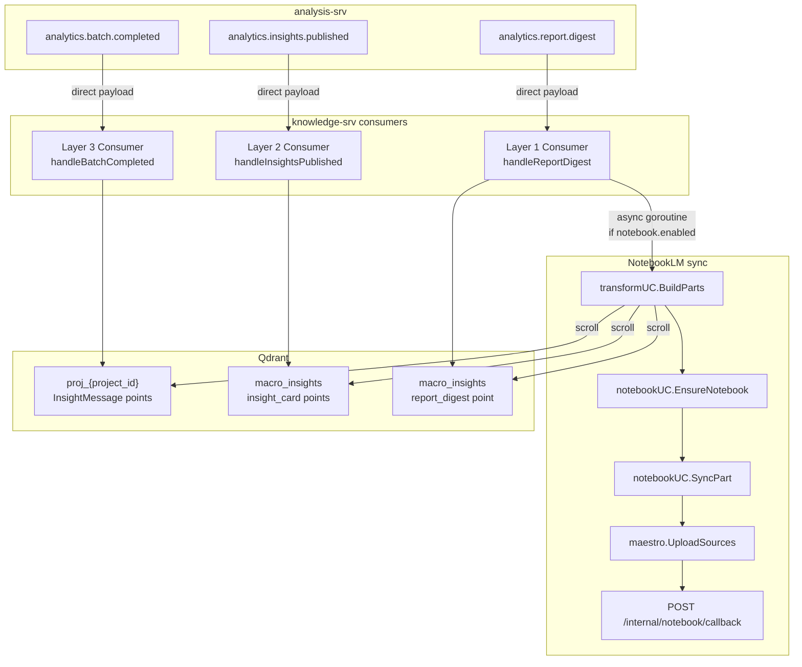
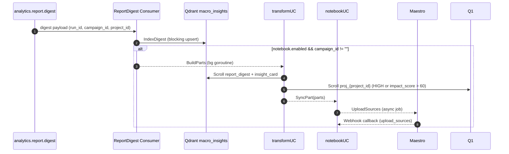
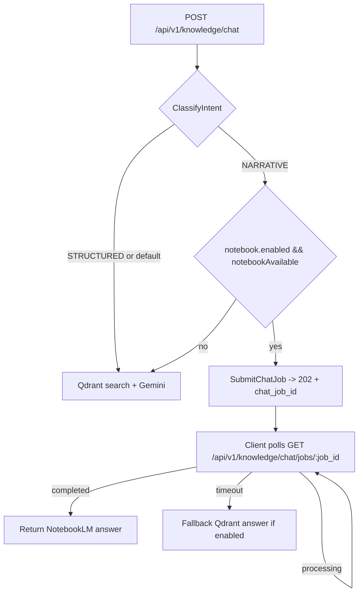

# SMAP Knowledge Service

Core service for SMAP platform handling RAG (Retrieval-Augmented Generation), Vector Search, Report Generation, and Analytics Indexing.

---

## Architecture

### System Overview



**Shared layers:** `internal/model` (Scope, entities), infra clients in `pkg/` (Qdrant, Gemini, Voyage, MinIO, Kafka, Maestro).

**4 Core Domains:**

- **Indexing**: Consumes analytics data (Kafka/HTTP), generates embeddings, and indexes to Qdrant.
- **Search**: Advanced vector search with filters (Sentiment, Aspect, Date) and Caching layers.
- **Chat**: RAG Q&A system with context-aware responses and dynamic follow-up suggestions.
- **Report**: Asynchronous report generation using Map-Reduce pattern (Aggregate -> Generate -> Compile).

### Data Ingestion + NotebookLM Sync



### Chat Flow (Qdrant vs NotebookLM)



**Notebook availability**: `notebookAvailable = HasSyncedForCampaign` (at least one `notebook_sources.status = SYNCED`).

---

## Tech Stack

| Component | Technology    | Purpose                            |
| --------- | ------------- | ---------------------------------- |
| Language  | Go 1.25+      | Backend                            |
| Framework | Gin           | HTTP routing                       |
| Vector DB | Qdrant        | High-performance vector search     |
| Database  | PostgreSQL    | Metadata, conversation history     |
| Cache     | Redis         | Caching search results, rate limit |
| Queue     | Kafka         | Async ingestion and events         |
| Storage   | MinIO         | Report storage (PDF/Markdown)      |
| AI Model  | Google Gemini | LLM for RAG and Reports            |
| Embedding | Voyage AI     | High-quality text embeddings       |

---

## Features

- **Real-time Indexing**: Ingests analytics data from Kafka/HTTP pipe.
- **Vector Search**: Semantic search with pre-filtering and post-filtering.
- **RAG Chat**: Contextual Q&A with citation and smart suggestions.
- **Smart Suggestions**: Dynamic follow-up questions based on real-time aggregation.
- **Async Reporting**: Generates deep-insight reports (Summary, Comparison, Trend).
- **Multi-layer Caching**: Optimizes performance for search and prompts.
- **Hallucination Control**: Strict context checking before answering.

---

## Quick Start

### Prerequisites

- Go 1.25+
- Docker & Docker Compose
- PostgreSQL 15+
- Qdrant 1.10+
- Redis 7+
- MinIO (S3 compatible)
- Kafka (optional for dev, required for ingestion)

### 1. Clone & Configure

```bash
git clone <repository-url>
cd knowledge-srv

# Copy config template
cp config/knowledge-config.example.yaml config/knowledge-config.yaml

# Edit with your secrets (API Keys, DB Creds)
nano config/knowledge-config.yaml
```

### 2. Setup Database

```bash
# Create database
createdb knowledge

# Run migration (creates schema 'knowledge' and tables)
# Note: Ensure you have migrations ready or use sqlboiler/schema
# psql -h localhost -U postgres -d knowledge -f migration/init.sql
```

### 3. Configure AI Keys

1. Get **Voyage AI** Key: [Dash](https://dash.voyageai.com/)
2. Get **Google Gemini** Key: [AI Studio](https://aistudio.google.com/)
3. Update `config/knowledge-config.yaml`:

```yaml
voyage:
  api_key: "vo_..."

gemini:
  api_key: "AIza..."
  model: "gemini-1.5-pro"
```

### 4. Run Services

```bash
# Start dependencies (if using docker-compose for deps)
# docker-compose up -d postgres qdrant redis minio kafka

# Run API service
make run-api
```

### 5. Test

```bash
# Health check
curl http://localhost:8080/health

# Trigger Indexing (Manual)
curl -X POST http://localhost:8080/api/v1/indexing/manual \
  -H "Content-Type: application/json" \
  -d '{"content": "Test post", "project_id": "p1"}'
```

---

## Configuration

Key settings in `config/knowledge-config.yaml`:

```yaml
# Environment
environment:
  name: development # production | staging

# Vector DB
qdrant:
  host: localhost
  port: 6334
  timeout: 30

# PostgreSQL
postgres:
  host: localhost
  port: 5432
  dbname: postgres
  schema: knowledge # Important: Use 'knowledge' schema

# AI Config
gemini:
  model: "gemini-1.5-pro"

# MinIO (Reports)
minio:
  bucket: "smap-reports"
  region: "us-east-1"
```

---

## API Endpoints

### Indexing Domain

- `POST /api/v1/indexing/manual` — Manual data ingestion.
- `POST /api/v1/indexing/batch` — Batch ingestion.

### Search Domain

- `POST /api/v1/search` — Vector search with filters.
- `POST /api/v1/search/aggregate` — Get statistics (sentiment, platform, aspects).

### Chat Domain

- `POST /api/v1/chat` — Send message (RAG).
- `GET /api/v1/chat/history` — Get conversation history.
- `GET /api/v1/chat/suggestions` — Get smart suggestions.

### Report Domain

- `POST /api/v1/reports/generate` — Request report generation (Async).
- `GET /api/v1/reports/:id` — Get report status.
- `GET /api/v1/reports/:id/download` — Download report file.

---

## Project Structure

```
knowledge-srv/
├── cmd/
│   ├── api/              # Main API server
│   └── consumer/         # Kafka consumer (if separate)
├── config/               # Configuration struct & yaml
├── internal/
│   ├── indexing/         # Domain: Ingestion & Embedding
│   ├── search/           # Domain: Retrieval & Aggregation
│   ├── chat/             # Domain: RAG & Conversation
│   ├── report/           # Domain: Report Generation
│   ├── point/            # Domain: Vector Point Management (Qdrant)
│   ├── embedding/        # Domain: Embedding Generation (Voyage)
│   ├── httpserver/       # Router, wiring, middleware
│   ├── model/            # Shared entities
│   └── middleware/       # Auth, CORS, logging
├── pkg/
│   ├── qdrant/           # Qdrant client wrapper
│   ├── gemini/           # Google Gemini client
│   ├── voyage/           # Voyage AI client
│   ├── minio/            # MinIO client
│   ├── kafka/            # Kafka wrappers
│   └── ...               # Utils
├── migration/            # SQL schemas
└── documents/            # Architecture & Plans
```

---

## Development

```bash
# Run API locally
make run-api

# Run Consumer
make run-consumer

# Generate Models (SQLBoiler)
make models

# Build Docker
make docker-build-api
```

---

## Deployment

### Docker

```bash
# Build
docker build -t knowledge-srv:latest -f cmd/api/Dockerfile .

# Run
docker run -d -p 8080:8080 \
  -v $(pwd)/config:/app/config \
  knowledge-srv:latest
```

### Kubernetes

Refer to `manifests/` folder (if available) or create standard Deployment/Service resources mapping the config via ConfigMap.

---

## Documentation

- [Master Proposal](documents/master-proposal.md) - Architecture Overview.
- [Indexing Plan](documents/domain_1_code_plan.md)
- [Search Plan](documents/domain_2_code_plan.md)
- [Chat Plan](documents/domain_3_code_plan.md)
- [Report Plan](documents/domain_4_code_plan.md)

---

## License

Part of SMAP graduation project.

---

**Last Updated**: 26/03/2026
