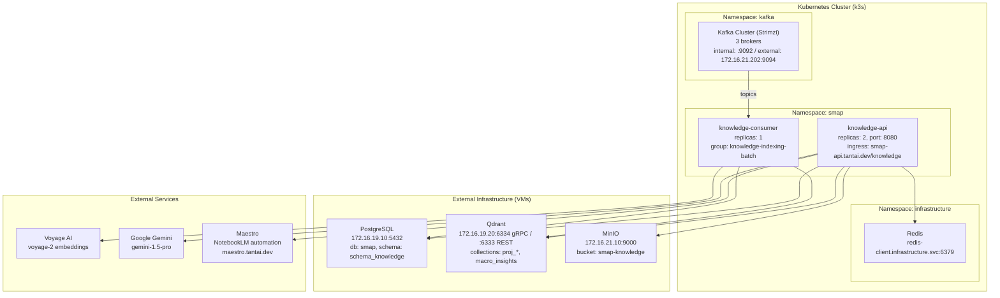

# Knowledge-srv Deployment Guide

> **Version**: 2.0 | **Date**: 27/03/2026
> **Environment**: Production (Kubernetes + External Infrastructure)

---

## Table of Contents

- [Infrastructure Overview](#infrastructure-overview)
- [Prerequisites](#prerequisites)
- [Configuration](#configuration)
- [Deployment Steps](#deployment-steps)
- [Verification](#verification)
- [Monitoring](#monitoring)
- [Troubleshooting](#troubleshooting)
- [Rollback](#rollback)

---

## Infrastructure Overview

### Architecture



---

## Prerequisites

### Required Access

- Kubernetes cluster access (kubectl configured)
- Access to external infrastructure:
  - PostgreSQL: 172.16.19.10:5432
  - Qdrant: 172.16.19.20:6334
  - MinIO: 172.16.21.10:9000
- API keys:
  - Voyage AI API key
  - Google Gemini API key
  - Maestro API key (optional, for NotebookLM)

### Required Tools

```bash
# Kubernetes CLI
kubectl version --client

# Docker (for building images)
docker --version

# PostgreSQL client (for verification)
psql --version

# curl (for testing)
curl --version
```

---

## Configuration

### Step 1: Setup Manifests

```bash
cd manifests

# Create config files from examples
./setup.sh

# This creates:
# - configmap.yaml (from configmap.yaml.example)
# - secret.yaml (from secret.yaml.example)
```

### Step 2: Edit ConfigMap

Edit `manifests/configmap.yaml`:

```yaml
apiVersion: v1
kind: ConfigMap
metadata:
  name: knowledge-config
  namespace: smap
data:
  # Environment
  ENVIRONMENT_NAME: "production"

  # External Infrastructure
  POSTGRES_HOST: "172.16.19.10"
  POSTGRES_PORT: "5432"
  POSTGRES_DB: "smap"
  POSTGRES_SCHEMA: "schema_knowledge"

  QDRANT_HOST: "172.16.19.20"
  QDRANT_PORT: "6334" # gRPC port

  MINIO_ENDPOINT: "172.16.21.10:9000"
  MINIO_BUCKET: "smap-knowledge"

  # In-cluster Services
  REDIS_HOST: "redis-client.infrastructure.svc.cluster.local"
  REDIS_PORT: "6379"

  KAFKA_BROKERS: "kafka-cluster-kafka-bootstrap.kafka.svc.cluster.local:9092"

  # AI Models
  GEMINI_MODEL: "gemini-1.5-pro"

  # NotebookLM (optional)
  NOTEBOOK_ENABLED: "false" # Set to "true" when Maestro is ready
```

### Step 3: Edit Secret

Edit `manifests/secret.yaml`:

```yaml
apiVersion: v1
kind: Secret
metadata:
  name: knowledge-secrets
  namespace: smap
type: Opaque
stringData:
  # PostgreSQL
  POSTGRES_USER: "knowledge_prod"
  POSTGRES_PASSWORD: "<your-postgres-password>"

  # Redis
  REDIS_PASSWORD: "<your-redis-password>"

  # MinIO
  MINIO_ACCESS_KEY: "<your-minio-access-key>"
  MINIO_SECRET_KEY: "<your-minio-secret-key>"

  # AI Services
  VOYAGE_API_KEY: "<your-voyage-api-key>"
  GEMINI_API_KEY: "<your-gemini-api-key>"

  # JWT & Encryption (minimum 32 characters)
  JWT_SECRET_KEY: "<your-jwt-secret-32-chars-minimum>"
  ENCRYPTER_KEY: "<your-encrypter-key-32-chars-minimum>"

  # Internal API
  INTERNAL_KEY: "<your-internal-api-key>"

  # Discord (optional)
  DISCORD_WEBHOOK_URL: "<your-discord-webhook-url>"

  # Qdrant (optional, leave empty if not required)
  QDRANT_API_KEY: ""
```

**Important**: Never commit these files to Git! They are already in `.gitignore`.

---

## Deployment Steps

### Step 1: Apply Configuration

```bash
# Apply ConfigMap and Secret
kubectl apply -f manifests/configmap.yaml
kubectl apply -f manifests/secret.yaml

# Verify
kubectl get configmap -n smap knowledge-config
kubectl get secret -n smap knowledge-secrets
```

### Step 2: Build Docker Images

```bash
# Build API image
docker build -t knowledge-api:latest -f cmd/api/Dockerfile .

# Build Consumer image
docker build -t knowledge-consumer:latest -f cmd/consumer/Dockerfile .

# Tag for registry (if using private registry)
docker tag knowledge-api:latest registry.example.com/knowledge-api:latest
docker tag knowledge-consumer:latest registry.example.com/knowledge-consumer:latest

# Push to registry
docker push registry.example.com/knowledge-api:latest
docker push registry.example.com/knowledge-consumer:latest
```

### Step 3: Deploy to Kubernetes

```bash
# Deploy API
kubectl apply -f cmd/api/deployment.yaml

# Deploy Consumer
kubectl apply -f cmd/consumer/deployment.yaml

# Verify deployments
kubectl get deployments -n smap
kubectl get pods -n smap
```

### Step 4: Verify Pods are Running

```bash
# Check pod status
kubectl get pods -n smap -l app=knowledge-api
kubectl get pods -n smap -l app=knowledge-consumer

# Check logs
kubectl logs -n smap -l app=knowledge-api --tail=50
kubectl logs -n smap -l app=knowledge-consumer --tail=50
```

---

## Verification

### 1. Health Check

```bash
# API health
curl http://knowledge-api:8080/health

# Or via ingress
curl https://smap-api.tantai.dev/knowledge/health
```

Expected response:

```json
{
  "status": "ok",
  "timestamp": "2026-03-27T00:00:00Z"
}
```

### 2. Database Connectivity

```bash
# From API pod
kubectl exec -n smap -it <api-pod-name> -- sh
# Inside pod:
# Check if tables exist (should see output, not error)
```

Or from local:

```bash
psql -h 172.16.19.10 -U knowledge_prod -d smap -c "\dt schema_knowledge.*"
```

### 3. Qdrant Connectivity

```bash
# Check collections
curl http://172.16.19.20:6333/collections

# Expected: List of collections including proj_* and macro_insights
```

### 4. Kafka Consumer

```bash
# Check consumer group
kubectl exec -n kafka kafka-cluster-broker-0 -- \
  /opt/kafka/bin/kafka-consumer-groups.sh \
  --bootstrap-server localhost:9092 \
  --group knowledge-indexing-batch --describe

# Expected: Consumer should be connected with LAG=0 or small number
```

### 5. Test Indexing

Send a test message to Kafka:

```bash
echo '{"batch_id":"test-001","project_id":"test-project","campaign_id":"test-campaign","documents":[{"identity":{"uap_id":"test_001","uap_type":"POST","uap_media_type":"video","platform":"tiktok","published_at":"2026-03-27T00:00:00Z"},"content":{"clean_text":"test message","summary":"test"},"nlp":{"sentiment":{"label":"positive","score":0.8}},"business":{"impact":{"impact_score":0.7,"priority":"high","engagement":{"likes":100,"comments":5,"shares":2,"views":1000}}},"rag":true}]}' | \
kubectl exec -i -n kafka kafka-cluster-broker-0 -- \
  /opt/kafka/bin/kafka-console-producer.sh \
  --bootstrap-server localhost:9092 \
  --topic analytics.batch.completed
```

Check consumer logs:

```bash
kubectl logs -n smap -l app=knowledge-consumer --tail=20
```

Expected: Log showing "Processing message" and "indexed=1"

### 6. Test Chat API

```bash
curl -X POST https://smap-api.tantai.dev/knowledge/chat \
  -H "Content-Type: application/json" \
  -H "Authorization: Bearer <your-token>" \
  -d '{
    "project_id": "test-project",
    "campaign_id": "test-campaign",
    "message": "What are the top brands?"
  }'
```

---

## Monitoring

### Logs

```bash
# API logs (real-time)
kubectl logs -n smap -l app=knowledge-api -f

# Consumer logs (real-time)
kubectl logs -n smap -l app=knowledge-consumer -f

# Last 100 lines
kubectl logs -n smap -l app=knowledge-api --tail=100
kubectl logs -n smap -l app=knowledge-consumer --tail=100
```

### Metrics

```bash
# Pod resource usage
kubectl top pods -n smap

# Consumer lag
kubectl exec -n kafka kafka-cluster-broker-0 -- \
  /opt/kafka/bin/kafka-consumer-groups.sh \
  --bootstrap-server localhost:9092 \
  --group knowledge-indexing-batch --describe
```

### Database Monitoring

```sql
-- Check indexed documents count
SELECT COUNT(*) FROM schema_knowledge.nb_campaigns;
SELECT COUNT(*) FROM schema_knowledge.nb_sources;

-- Check recent activity
SELECT * FROM schema_knowledge.nb_sources
ORDER BY created_at DESC LIMIT 10;

-- Check sync status
SELECT campaign_id, status, COUNT(*)
FROM schema_knowledge.nb_sources
GROUP BY campaign_id, status;
```

### Qdrant Monitoring

```bash
# Check collection sizes
curl http://172.16.19.20:6333/collections | jq '.result.collections[] | {name, points_count}'

# Check specific collection
curl -X POST http://172.16.19.20:6333/collections/macro_insights/points/count \
  -H "Content-Type: application/json" \
  -d '{}'
```

---

## Troubleshooting

### Consumer Not Processing Messages

**Symptom**: LAG increasing, no logs in consumer

**Diagnosis**:

```bash
# Check consumer group
kubectl exec -n kafka kafka-cluster-broker-0 -- \
  /opt/kafka/bin/kafka-consumer-groups.sh \
  --bootstrap-server localhost:9092 \
  --group knowledge-indexing-batch --describe

# Check consumer logs
kubectl logs -n smap -l app=knowledge-consumer --tail=100
```

**Solutions**:

1. Check if consumer pod is running: `kubectl get pods -n smap`
2. Check if Kafka is accessible: `kubectl get svc -n kafka`
3. Restart consumer: `kubectl rollout restart deployment/knowledge-consumer -n smap`
4. Check for zombie consumers (local processes): `lsof -i :9094`

### Qdrant Connection Failed

**Symptom**: Logs show "failed to connect to Qdrant"

**Diagnosis**:

```bash
# Test connectivity from pod
kubectl exec -n smap -it <pod-name> -- sh
# Inside pod: try to reach Qdrant
# (Note: wget/curl may not be available in minimal images)
```

**Solutions**:

1. Verify Qdrant is running: `curl http://172.16.19.20:6333/collections`
2. Check network connectivity from cluster to external IP
3. Verify QDRANT_HOST and QDRANT_PORT in configmap
4. Check if port 6334 (gRPC) is open, not 6333 (REST)

### PostgreSQL Connection Failed

**Symptom**: Logs show "failed to connect to PostgreSQL"

**Diagnosis**:

```bash
# Test from local
psql -h 172.16.19.10 -U knowledge_prod -d smap -c "SELECT 1"
```

**Solutions**:

1. Verify credentials in secret
2. Check if PostgreSQL allows connections from cluster IPs
3. Verify schema exists: `\dn` in psql
4. Check if tables exist: `\dt schema_knowledge.*`

### NotebookLM Sync Not Working

**Symptom**: Digest indexed but no notebook sync

**Diagnosis**:

```bash
# Check if notebook is enabled
kubectl get configmap -n smap knowledge-config -o yaml | grep NOTEBOOK_ENABLED

# Check consumer logs for "BuildParts" or "SyncPart"
kubectl logs -n smap -l app=knowledge-consumer | grep -i notebook
```

**Solutions**:

1. Verify `NOTEBOOK_ENABLED: "true"` in configmap
2. Check Maestro API key in secret
3. Verify webhook callback URL is accessible from Maestro
4. Check database for sync status:
   ```sql
   SELECT * FROM schema_knowledge.nb_sources ORDER BY created_at DESC LIMIT 5;
   ```

---

## Rollback

### Rollback Deployment

```bash
# Rollback API
kubectl rollout undo deployment/knowledge-api -n smap

# Rollback Consumer
kubectl rollout undo deployment/knowledge-consumer -n smap

# Check rollout history
kubectl rollout history deployment/knowledge-api -n smap
kubectl rollout history deployment/knowledge-consumer -n smap
```

### Rollback Configuration

```bash
# Restore previous configmap
kubectl apply -f manifests/configmap.yaml.backup

# Restart pods to pick up new config
kubectl rollout restart deployment/knowledge-api -n smap
kubectl rollout restart deployment/knowledge-consumer -n smap
```

### Emergency: Disable NotebookLM

If NotebookLM sync is causing issues:

```bash
# Edit configmap
kubectl edit configmap -n smap knowledge-config

# Change: NOTEBOOK_ENABLED: "false"

# Restart consumer
kubectl rollout restart deployment/knowledge-consumer -n smap
```

---

## Maintenance

### Scaling

```bash
# Scale API (horizontal)
kubectl scale deployment/knowledge-api -n smap --replicas=3

# Scale consumer (be careful with Kafka partitions)
kubectl scale deployment/knowledge-consumer -n smap --replicas=2
```

**Note**: Consumer replicas should not exceed number of Kafka partitions.

### Update Configuration

```bash
# Edit configmap
kubectl edit configmap -n smap knowledge-config

# Or apply new file
kubectl apply -f manifests/configmap.yaml

# Restart to pick up changes
kubectl rollout restart deployment/knowledge-api -n smap
kubectl rollout restart deployment/knowledge-consumer -n smap
```

### Database Migration

```bash
# Run migration from local
psql -h 172.16.19.10 -U knowledge_prod -d smap -f migrations/XXX_new_migration.sql

# Or from pod
kubectl exec -n smap -it <api-pod-name> -- sh
# Copy migration file and run
```

---

## Security Checklist

- [ ] ConfigMap and Secret files are gitignored
- [ ] API keys are stored in Kubernetes Secret, not ConfigMap
- [ ] PostgreSQL password is strong (minimum 16 characters)
- [ ] JWT secret is strong (minimum 32 characters)
- [ ] Encrypter key is strong (minimum 32 characters)
- [ ] Internal API key is set and not default
- [ ] Qdrant API key is set (if Qdrant requires auth)
- [ ] Network policies are configured (if required)
- [ ] Ingress TLS is enabled
- [ ] Discord webhook URL is kept secret

---

## Support

For issues or questions:

- Check logs: `kubectl logs -n smap -l app=knowledge-api`
- Check documentation: `documents/`
- Check test plan: `documents/ops/stg-test-plan.md`

---

**Last Updated**: 27/03/2026
