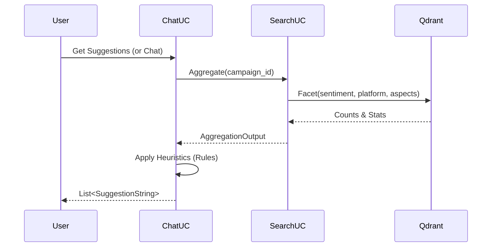

# Domain 3 (Extension): Smart Suggestions -- Chi tiết Plan Code

**Version:** 1.0  
**Last Updated:** 2026-02-17  
**Feature:** `internal/chat` -- Dynamic Smart Suggestions via `internal/search` Aggregation

---

## I. TỔNG QUAN

### 1. Mục tiêu

Thay thế logic suggestion tĩnh ("hardcoded") hiện tại bằng hệ thống gợi ý động dựa trên **thời gian thực** từ dữ liệu campaign. Hệ thống sẽ phân tích sơ bộ dữ liệu để đưa ra các câu hỏi follow-up có giá trị nhất cho người dùng.

### 2. Logic Gợi ý (Heuristics)

Hệ thống sẽ thực hiện **Aggregation Query** vào Qdrant và áp dụng các rules sau:

1.  **Top Negative Aspects (Vấn đề nóng):**
    - Tìm các aspect có số lượng phản hồi tiêu cực lớn nhất.
    - _Gợi ý:_ "Tại sao khía cạnh **[Aspect Name]** lại bị đánh giá tiêu cực?"

2.  **Platform Comparison (So sánh nền tảng):**
    - Nếu dữ liệu phân bố trên nhiều nền tảng (VD: TikTok > 20%, Facebook > 20%).
    - _Gợi ý:_ "So sánh phản hồi giữa **[Platform A]** và **[Platform B]**?"

3.  **Polarized Sentiment (Dư luận trái chiều):**
    - Nếu tỉ lệ Positive và Negative đều cao (> 30% mỗi loại).
    - _Gợi ý:_ "Tại sao có sự trái chiều trong đánh giá về **[Campaign Subject]**?"

4.  **Trend/Insight (Tổng quan):**
    - Disclaimer: Mặc định nếu không có pattern đặc biệt.
    - _Gợi ý:_ "Tổng quan sentiment của chiến dịch này?"

---

## II. KIẾN TRÚC THAY ĐỔI

### 1. `internal/search` (Provider)

Search domain cần cung cấp API mới để lấy thống kê (Aggregation) nhanh chóng mà không cần tải chi tiết documents.

- **New Capability:** `Aggregate(ctx, filter)`
- **Technology:** Sử dụng **Qdrant Facet API** (nhanh hơn search thông thường vì chỉ count).
- **Caching:** Áp dụng cache ngắn hạn (1-5 phút) cho kết quả aggregation.

### 2. `internal/chat` (Consumer)

Chat domain gọi API Aggregation của Search domain trước khi trả về response cho user (hoặc gọi song song với bước generate answer).



---

## III. CODEBASE STRUCTURE UPDATE

### 1. Domain `internal/search`

```
internal/search/
├── repository/
│   ├── interface.go            # [MOD] Add Facet() to QdrantRepository
│   └── qdrant/
│       └── facet.go            # [NEW] Impl Facet using client.Search(Group/Facet)
├── usecase/
│   ├── aggregate.go            # [NEW] Impl Aggregate() logic
│   └── helpers.go              # [MOD] Add aggregation helpers
├── interface.go                # [MOD] Add Aggregate() to UseCase
└── types.go                    # [MOD] Add AggregateInput/Output structs
```

### 2. Domain `internal/chat`

```
internal/chat/
├── usecase/
│   └── suggestion.go           # [MOD] Replace static list with dynamic logic calling searchUC.Aggregate
```

---

## IV. CHI TIẾT IMPLEMENTATION

### A. SEARCH DOMAIN UPDATES

#### 1. Types (`internal/search/types.go`)

```go
// AggregateInput - Input cho thống kê
type AggregateInput struct {
    CampaignID string
    // Có thể mở rộng thêm DateRange nếu cần suggestion theo thời gian
}

// AggregateOutput - Kết quả thống kê
type AggregateOutput struct {
    TotalDocs          uint64
    SentimentBreakdown map[string]uint64 // POSITIVE: 100, NEGATIVE: 20
    PlatformBreakdown  map[string]uint64 // tiktok: 50, facebook: 50
    TopNegativeAspects []AspectCount     // Top aspects bị chê
}

type AspectCount struct {
    Aspect string
    Count  uint64
}
```

#### 2. Qdrant Repository (`internal/search/repository/qdrant/facet.go`)

Sử dụng Facet API của Qdrant (hoặc Value Count aggregation).
_Note: Vì thư viện Go client Qdrant có thể chưa hỗ trợ Facet native tiện lợi, ta có thể dùng Search với `Limit: 0` và `Group` hoặc trick với Payload Count._
_Simple approach:_ Dùng `Count` với filter loop cho các field quan trọng (ít performant hơn nhưng dễ impl), hoặc dùng `Search` groups.
_Optimal approach:_ Qdrant v1.10+ hỗ trợ Facet request. Nếu client chưa update, ta dùng `Search` group by field.

Giả sử dùng approach **Search Groups** để lấy counts (hoặc facet nếu có).

```go
func (r *implQdrantRepository) Facet(ctx context.Context, field string, filter *pb.Filter) (map[string]uint64, error) {
    // Implementation using Qdrant Facet/Group API
    // Return map[value]count
}
```

#### 3. UseCase Aggregation (`internal/search/usecase/aggregate.go`)

```go
func (uc *implUseCase) Aggregate(ctx context.Context, sc model.Scope, input search.AggregateInput) (search.AggregateOutput, error) {
    // 1. Resolve campaign -> projects
    projectIDs, _ := uc.resolveCampaignProjects(ctx, input.CampaignID)

    // 2. Build Base Filter (Project IN [...])
    baseFilter := uc.buildBaseFilter(projectIDs)

    // 3. Parallel Execution (ErrGroup)
    // - Task A: Count by Sentiment
    // - Task B: Count by Platform
    // - Task C: Count Top Negative Aspects (Filter: Sentiment=NEGATIVE, GroupBy: aspects.aspect)

    // 4. Combine & Return
}
```

### B. CHAT DOMAIN UPDATES

#### 1. Suggestion Logic (`internal/chat/usecase/suggestion.go`)

```go
func (uc *implUseCase) generateSuggestions(query string, searchOut search.SearchOutput) []string {
    // NOTE: Hiện tại ChatUC đang gọi searchUC.Search().
    // SearchOutput HIỆN TẠI đã có Aggregations (do SearchUC tự aggregate từ kết quả search).
    // Tuy nhiên, Aggregation từ Search() chỉ dựa trên Top N documents (context window),
    // không phải TOÀN BỘ dataset.

    // PA 1 (Simple): Dùng luôn SearchOutput (Local context suggestions).
    // -> Nhanh, không gọi thêm DB. Tốt cho "Follow-up context".

    // PA 2 (Comprehensive): Gọi thêm searchUC.Aggregate() (Global context suggestions).
    // -> Tốt cho "New directions".

    // ĐỀ XUẤT: Kết hợp. Ưu tiên PA 2 cho API /suggestions (người dùng chưa chat).
    // Dùng PA 1 cho API /chat (đang trong luồng).

    // Dưới đây là logic cho API /suggestions (Global):

    agg, err := uc.searchUC.Aggregate(ctx, sc, input)
    var suggestions []string

    // Rule 1: Negative Aspects
    if len(agg.TopNegativeAspects) > 0 {
        top := agg.TopNegativeAspects[0]
        suggestions = append(suggestions, fmt.Sprintf("Tại sao vấn đề %s lại phổ biến?", top.Aspect))
    }

    // Rule 2: Platform Comparison
    if len(agg.PlatformBreakdown) >= 2 {
        suggestions = append(suggestions, "So sánh phản hồi giữa các nền tảng?")
    }

    return suggestions
}
```

---

## V. KẾ HOẠCH TRIỂN KHAI

1.  **Phase 1 (`internal/search`):** Implement `Facet` repo layer & `Aggregate` usecase layer.
2.  **Phase 2 (`internal/chat`):** Integrate `Aggregate` vào `GetSuggestions` usecase.
3.  **Phase 3 (Verify):** Viết unit test & manual test với dữ liệu mẫu.
