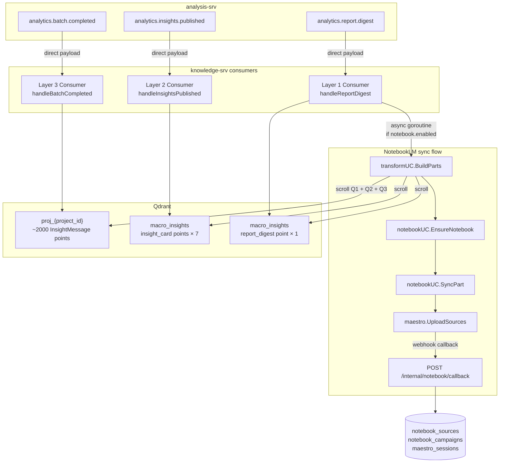

# NotebookLM Integration Architecture

> **Version:** 1.1 | **Date:** 2026-03-26 (review sync)
> **Status:** Implemented — document aligned with `internal/` (see §12 gaps)
> **Supersedes:** `proposal.md` (v2.0, legacy MinIO flow), `plan.md`, `plan-details.md`

---

## 1. Tại sao cần cập nhật kiến trúc

`proposal.md` (v2.0) được viết cho flow cũ: trigger NotebookLM sync sau mỗi `analytics.batch.completed` → đọc `AnalyticsPost` từ MinIO → build markdown → sync.

Sau khi hoàn thành **refactor 3-layer** (M1–M6), flow đã thay đổi căn bản:

| Thay đổi | Legacy (proposal v2.0) | Hiện tại (post-refactor) |
|----------|------------------------|--------------------------|
| Trigger point | Sau `BatchCompleted` consumer | Sau `ReportDigest` consumer |
| Input format | `AnalyticsPost` + MinIO JSONL | `InsightMessage[]` direct payload |
| Run-completion signal | Không có | `analytics.report.digest` (cuối cùng trong run) |
| `campaign_id` BLOCKER | ❌ Chưa có, cần analysis-srv thêm | ✅ Đã có trong cả 3 Kafka messages |
| Dữ liệu sẵn có | Chỉ raw posts | Layer 3 (posts) + Layer 2 (insights) + Layer 1 (digest prose) |

**Kết luận:** `analytics.report.digest` là tín hiệu "run hoàn thành" tự nhiên — knowledge-srv đã dùng nó để trigger NotebookLM export theo contract với analysis-srv. Đây là điểm hook chính xác nhất.

---

## 2. Kiến trúc tổng thể (post-refactor)



---

## 3. Trigger mechanism

**Điều kiện kích hoạt NotebookLM sync:**

```
handleReportDigestMessage()
    │
    ├─► IndexDigest(ctx, input)          // Upsert vào macro_insights (blocking)
    │       → point ID: digest:{run_id}
    │
    └─► [nếu notebook.enabled == true && input.CampaignID != ""]
            go func() {                  // Non-blocking goroutine
                bgCtx := context.Background()
                parts, err := transformUC.BuildParts(bgCtx, TransformInput{...})
                sc := model.Scope{UserID: "system", Role: "system"}  // notebook API dùng model.Scope
                → notebookUC.SyncPart(bgCtx, sc, SyncPartInput{...})
            }()
```

**Tại sao non-blocking goroutine:**

- NotebookLM sync có thể mất 30–120s (Maestro job polling)
- Kafka consumer không nên block — phải commit offset sau IndexDigest thành công
- Failure trong sync không ảnh hưởng đến indexing pipeline chính

---

## 4. Dữ liệu được sync lên NotebookLM

Mỗi run tạo ra 1 `MarkdownPart` (hoặc nhiều part nếu vượt size limit). Content gồm 3 nguồn:

### 4.1 Layer 1 — Digest Prose (đã có sẵn)

`buildDigestProse()` trong `internal/indexing/usecase/index_digest.go` đã tạo prose text. `internal/transform/` sẽ tái sử dụng logic tương tự để build markdown section:

```markdown
## Campaign Report: {domain_overlay}
Platform: {platform} | Total Mentions: {total_mentions}
Analysis Window: {start} to {end}

### Top Brands
- Cetaphil: 234 mentions (11.7% share)
- CeraVe: 233 mentions (11.6% share)
...

### Key Discussion Topics
- Cleanser Brand and Product Comparison: 364 mentions (quality: 0.98)
  Example: "Dùng thử 5 loại sữa rửa mặt..."
...

### Critical Issues
- fake_authenticity_concern: 200 mentions (pressure: 149.48)
...
```

### 4.2 Layer 2 — Insight Cards (scroll từ Qdrant)

Scroll `macro_insights` WHERE `run_id = {run_id}` AND `rag_document_type = "insight_card"`:

```markdown
## Insights for Run {run_id}

### Share of Voice Shift — Cetaphil (confidence: 0.56)
Cetaphil lost 22 mention(s) in the later half of the window.
Evidence: tt_p_fc_0001, tt_c_fc_0001_02, ...

### Issue Warning — fake_authenticity_concern (confidence: 0.78)
...
```

### 4.3 Layer 3 — Top-N Documents (scroll từ Qdrant)

Scroll `proj_{project_id}` WHERE `priority = "HIGH"` OR `impact_score > 60`, limit top 50:

```markdown
## High-Impact Posts (Run {run_id})

**tt_p_fc_0001** [TIKTOK | post | POSITIVE]
cetaphil oily dùng da nhạy cảm thấy ổn áp ghê, rửa sạch mà không bị kích ứng
Engagement: 2837 likes · 13 comments · 27 shares · 25512 views

...
```

---

## 5. Cấu trúc package mới

```text
internal/
└── transform/                         # NEW package
    ├── interface.go                   # UseCase interface
    ├── types.go                       # TransformInput, TransformOutput
    └── usecase/
        ├── new.go                     # Constructor (inject pointUC)
        └── build_parts.go             # BuildParts: scroll Qdrant → assemble markdown

internal/notebook/
    ├── interface.go                   # ✅ Đã có
    ├── types.go                       # ✅ Đã có (MarkdownPart, SyncPartInput, ...)
    ├── usecase/
    │   ├── new.go                     # ✅ Constructor
    │   ├── session.go                 # ✅ StartSessionLoop
    │   ├── webhook.go                 # ✅ HandleWebhook
    │   ├── ensure.go                  # ✅ EnsureNotebook + pollJobUntilDone
    │   ├── sync.go                    # ✅ SyncPart, RetryFailed
    │   ├── query.go                   # ✅ SubmitChatJob, GetChatJobStatus (poll Maestro)
    │   └── availability.go            # ✅ HasSyncedForCampaign, ApplyChatFallback
    ├── delivery/http/
    │   ├── handlers.go                # ✅ Đã có (POST /internal/notebook/callback)
    │   └── routes.go                  # ✅ Đã có
    └── repository/postgre/
        ├── campaign.go                # ✅ Đã có
        ├── source.go                  # ✅ Đã có
        ├── session.go                 # ✅ Đã có
        └── chat_job.go                # ✅ Đã có
```

---

## 6. Wiring vào consumer pipeline

### 6.1 `internal/indexing/delivery/kafka/consumer/new.go`

Thêm 2 optional fields vào `consumer` struct:

```go
type consumer struct {
    uc          indexing.UseCase
    notebookUC  notebook.UseCase   // optional, nil nếu disabled
    transformUC transform.UseCase  // optional, nil nếu disabled
    // ... existing fields
}
```

### 6.2 `internal/consumer/handler.go`

Inject `notebookUC` + `transformUC` vào indexing consumer khi `appConfig.Notebook.Enabled` và `maestroClient != nil`. Cần import (rút gọn):

```go
import (
    "knowledge-srv/internal/model"
    "knowledge-srv/internal/notebook"
    notebookPostgre "knowledge-srv/internal/notebook/repository/postgre"
    notebookUsecase "knowledge-srv/internal/notebook/usecase"
    "knowledge-srv/internal/transform"
    transformUsecase "knowledge-srv/internal/transform/usecase"
)
```

Chi tiết đầy đủ xem **§12 GAP-5** (pseudo-code đã khớp `notebookUsecase.Config` và constructor repo).

### 6.3 `internal/indexing/delivery/kafka/consumer/workers.go`

Sau `IndexDigest` thành công — **trong goroutine** phải tự định nghĩa `sc` (notebook `SyncPart` nhận `model.Scope`, không phải `auth.Scope`):

```go
import (
    "context"
    "knowledge-srv/internal/model"
    "knowledge-srv/internal/notebook"
    "knowledge-srv/internal/transform"
    // github.com/smap-hcmut/shared-libs/go/auth — đã dùng cho IndexDigest ctx
)

// Sau IndexDigest OK, message = kafka.ReportDigestMessage:
if c.notebookUC != nil && c.transformUC != nil && message.CampaignID != "" {
    go func() {
        bgCtx := context.Background()
        parts, err := c.transformUC.BuildParts(bgCtx, transform.TransformInput{
            ProjectID:   message.ProjectID,
            CampaignID:  message.CampaignID,
            RunID:       message.RunID,
            WindowStart: message.AnalysisWindowStart,
        })
        if err != nil { /* log */ return }
        if len(parts) == 0 { return }

        sc := model.Scope{UserID: "system", Role: "system"}
        _ = c.notebookUC.SyncPart(bgCtx, sc, notebook.SyncPartInput{
            CampaignID: message.CampaignID,
            Parts:      parts,
        })
    }()
}
```

**Kafka `ReportDigestMessage`** (package `internal/indexing/delivery/kafka`): `ProjectID`, `CampaignID`, `RunID`, `AnalysisWindowStart` (RFC3339), `ShouldIndex`, `DomainOverlay`, … — khớp field `TransformInput` và `toIndexDigestInput`.

---

## 7. `internal/transform/` — Chi tiết thiết kế

### interface.go

```go
package transform

import (
    "context"
    "knowledge-srv/internal/notebook"
)

type UseCase interface {
    BuildParts(ctx context.Context, input TransformInput) ([]notebook.MarkdownPart, error)
}
```

### types.go

```go
type TransformInput struct {
    ProjectID   string
    CampaignID  string
    RunID       string
    WindowStart string // RFC3339 — dùng để tính PeriodLabel (ISO week)
}
```

### Qdrant scroll (triển khai thực tế)

- **Layer 1 — digest:** collection `macro_insights`, filter `run_id` + `rag_document_type = "report_digest"` (scroll `pointUC.Scroll`).
- **Layer 2 — insight cards:** cùng collection, `rag_document_type = "insight_card"` + `run_id`.
- **Layer 3 — posts:** collection `proj_{project_id}`, filter **Should**: `priority` = `"HIGH"` **hoặc** `impact_score` **>** `60` (Qdrant `Filter.Should`), `Limit` = `max_posts_per_part` (mặc định 50).

Payload field names khớp indexing: `digest` theo struct digest trong `index_digest`; insight card theo `index_insight`; project posts theo `insightPayload` / `buildInsightPayload` (`uap_id`, `content_summary`, `sentiment_label`, `impact_score`, `priority`, engagement, …).

### usecase/build_parts.go — Logic

```
BuildParts(ctx, input):
    1. periodLabel = isoWeekLabel(input.WindowStart)  // e.g. "2026-W09"

    2. digestProse = scrollMacroInsights(run_id, rag_document_type="report_digest")
       → format thành Section "## Campaign Report"

    3. insightCards = scrollMacroInsights(run_id, rag_document_type="insight_card")
       → format thành Section "## Insights"

    4. topDocs = scrollProjectCollection(project_id, priority="HIGH", limit=50)
       → format thành Section "## High-Impact Posts"

    5. content = join(digestProse + insightCards + topDocs)

    6. Return []MarkdownPart{
           Title:       fmt.Sprintf("SMAP | %s | %s", campaignID, periodLabel),
           Content:     content,
           WeekLabel:   periodLabel,
           PartNum:     1,
           PostCount:   len(topDocs),
           ContentHash: sha256(content)[:16],
       }
```

**Chunking:** Nếu `len(content) > 500_000` bytes (Maestro limit), tách thành nhiều Part (Part 1, Part 2, ...).

---

## 8. `internal/notebook/usecase/ensure.go` — Chi tiết thiết kế

```
EnsureNotebook(ctx, sc, campaignID, periodLabel):
    1. Query notebook_campaigns WHERE campaign_id + period_label
    2. Nếu tìm thấy → return NotebookInfo
    3. Không tìm thấy:
       a. ensureSession(ctx) → lấy activeSessionID
       b. maestro.CreateNotebook(sessionID, {name: "SMAP | {campaignID} | {periodLabel}"})
          → returns JobEnqueued{JobID}
       c. pollJobUntilDone(ctx, jobID) → JobData{NotebookID}
       d. campaignRepo.Create(ctx, campaignID, periodLabel, notebookID)  // DB: không cột session_id (xem migration 008)
       e. Return NotebookInfo{ID: notebookID, ...}
```

---

## 9. `internal/notebook/usecase/sync.go` — Chi tiết thiết kế

```
SyncPart(ctx, sc, input):
    For each part in input.Parts:
        1. sourceRepo.GetByContentHash(ctx, campaignID, part.ContentHash)
           → status=SYNCED → skip (idempotent)
        2. notebookInfo = EnsureNotebook(ctx, sc, campaignID, part.WeekLabel)
        3. maestro.UploadSources(..., SourceType: "text", Sources: [{Title, Content}], WebhookURL, WebhookSecret)
           → JobEnqueued{JobID}
        4. sourceRepo.CreateUploading(ctx, SourceUpsertInput{..., maestro_job_id, status=UPLOADING})
        (Webhook: upload_sources → UpdateStatusByMaestroJobID)
```

---

## 10. Chat routing (Phase 3 — unchanged from plan.md)

Sau khi NotebookLM có dữ liệu, chat API cần route câu hỏi:

```
POST /api/v1/knowledge/chat { campaign_id, message, ... }
    │
    ├─► ClassifyIntent(message)
    │       NARRATIVE: "xu hướng", "đánh giá", "tổng quan", "phân tích", "insight"
    │       STRUCTURED: "bao nhiêu", "thống kê", "top", "so sánh", "filter"
    │       Default: STRUCTURED (safe fallback)
    │
    ├─► STRUCTURED → Qdrant flow (hiện tại, sync 200 OK)
    │
    └─► NARRATIVE && notebook.enabled && notebookAvailable
            → Submit async job → 202 + chat_job_id
            → Client polls GET /api/v1/knowledge/chat/jobs/:job_id
            → Timeout `notebook.chat_timeout_sec` (mặc định 45) + `router.notebook_fallback_enabled` → fallback Qdrant

`notebookAvailable` = `HasSyncedForCampaign` (ít nhất một `notebook_sources.status = SYNCED`).
```

---

## 11. Implementation checklist (N1–N4) — **đã implement**

Bảng dưới là checklist gốc; trạng thái hiện tại: **done**. Chi tiết kỹ thuật và tên API chính xác nằm ở **§7**, **§12**.

### Phase N1 — Transform

| File | Trạng thái |
|------|------------|
| `internal/transform/interface.go`, `types.go`, `usecase/new.go`, `usecase/build_parts.go`, `usecase/build_markdown.go` | ✅ |

### Phase N2 — Notebook

| File | Trạng thái |
|------|------------|
| `internal/notebook/usecase/ensure.go`, `sync.go`, `query.go`, `availability.go` | ✅ |

### Phase N3 — Consumer

| File | Trạng thái |
|------|------------|
| `internal/indexing/delivery/kafka/consumer/new.go`, `workers.go` | ✅ |
| `internal/consumer/handler.go` (+ `StopSessionLoop` trong `stopConsumers`) | ✅ |

### Phase N4 — Chat

| File | Trạng thái |
|------|------------|
| `internal/chat/usecase/router.go`, `chat.go` | ✅ |
| `internal/chat/delivery/http/handlers.go` (`GET /chat/jobs/:job_id`), `routes.go` | ✅ — không dùng file `handlers_async.go` riêng |
| `internal/notebook/usecase/query.go` | ✅ poll Maestro trong `GetChatJobStatus` |

---

## 12. Feature flag + configuration

```yaml
# config/knowledge-config.yaml
notebook:
  enabled: false          # Bật khi Phase N1+N2+N3 hoàn thành
  max_posts_per_part: 50
  retention_quarters: 2
  sync_retry_interval_min: 30
  sync_max_retries: 3
  chat_timeout_sec: 45

maestro:
  base_url: "https://maestro.tantai.dev/maestro"
  api_key: ""             # Required khi notebook.enabled=true
  session_env: "LOCAL"    # LOCAL | BROWSERBASE
  session_health_interval_sec: 60
  job_poll_interval_ms: 2000
  job_poll_max_attempts: 30
  webhook_secret: ""
  webhook_callback_url: ""  # e.g. https://knowledge-srv.internal/internal/notebook/callback
```

**Điều kiện để bật `notebook.enabled=true`:**

1. Phase N1 + N2 + N3 hoàn thành
2. Maestro instance có `api_key` hợp lệ
3. `webhook_callback_url` accessible từ Maestro (ngrok hoặc internal DNS)

---

## 12. Gap analysis — Repo hiện tại vs Architecture

> Đây là phần chính để agent code và reviewer theo dõi. Mỗi gap có trạng thái, file cụ thể, vấn đề hiện tại, và việc cần làm.

---

### GAP-1: `internal/transform/` — Sai input model (BREAKING) — **ĐÃ XỬ LÝ**

**Severity: HIGH** — trước đây `transform` dùng legacy `AnalyticsPost`; hiện đã rewrite theo 3-layer.

| Thành phần | Trạng thái repo |
|------------|-----------------|
| [internal/transform/types.go](../../internal/transform/types.go) | `TransformInput`: `ProjectID`, `CampaignID`, `RunID`, `WindowStart` |
| [internal/transform/usecase/new.go](../../internal/transform/usecase/new.go) | `New(pointUC point.UseCase, maxPostsPerPart int, l log.Logger)` |
| [internal/transform/usecase/build_parts.go](../../internal/transform/usecase/build_parts.go) | `BuildParts` → scroll Qdrant (macro + proj) |
| [internal/transform/usecase/build_markdown.go](../../internal/transform/usecase/build_markdown.go) | Format digest / insight / post từ payload map |

**Ghi chú:** `BuildParts` nhận `context.Context` làm tham số đầu (xem §7).

---

### GAP-2: `internal/notebook/usecase/` — Ensure / Sync / Retry — **ĐÃ XỬ LÝ**

**Severity: HIGH** — trước đây stub; hiện logic nằm trong `ensure.go`, `sync.go`, `query.go`.

**Repository — chữ ký thực tế** (xem [internal/notebook/repository/interface.go](../../internal/notebook/repository/interface.go)):

| Repo | Method |
|------|--------|
| `CampaignRepo` | `GetByCampaignAndPeriod(ctx, campaignID, periodLabel string) (notebook.NotebookInfo, error)` — `repository.ErrNotFound` nếu không có |
| `CampaignRepo` | `Create(ctx, campaignID, periodLabel, notebookID string) error` — **không** có `session_id` trong DB (`migrations/008` chỉ `campaign_id`, `period_label`, `notebook_id`, …) |
| `SourceRepo` | `GetByContentHash(ctx, campaignID, contentHash string) (notebook.SourceRecord, error)` |
| `SourceRepo` | `CreateUploading(ctx, in notebook.SourceUpsertInput) error` |
| `SourceRepo` | `ListFailedRetryable(ctx, maxRetries int) ([]notebook.SourceRecord, error)` |
| `SourceRepo` | `HasSyncedForCampaign(ctx, campaignID string) (bool, error)` |

**`notebook.SourceRecord`** — xem [internal/notebook/types.go](../../internal/notebook/types.go): `ID`, `CampaignID`, `NotebookID`, `WeekLabel`, `PartNumber`, `Title`, `PostCount`, `ContentHash`, `MaestroJobID`, `Status`, `RetryCount`.

**Pseudo-code đã chỉnh tên:**

**`internal/notebook/usecase/ensure.go`**

```
EnsureNotebook(ctx, sc, campaignID, periodLabel):
    1. campaignRepo.GetByCampaignAndPeriod(ctx, campaignID, periodLabel)
       → found: return NotebookInfo
    2. not found:
       a. activeSession từ mutex
       b. maestro.CreateNotebook(...)
       c. pollJobUntilDone → notebook_id
       d. campaignRepo.Create(ctx, campaignID, periodLabel, notebookID)
       e. return NotebookInfo
```

**`internal/notebook/usecase/sync.go`**

```
SyncPart(ctx, sc, input):
    for each part:
        1. sourceRepo.GetByContentHash(ctx, campaignID, part.ContentHash) — SYNCED → skip
        2. EnsureNotebook(..., part.WeekLabel)
        3. maestro.UploadSources(..., SourceType: "text", ...)
        4. sourceRepo.CreateUploading(ctx, SourceUpsertInput{..., status: UPLOADING})

RetryFailed:
    ListFailedRetryable — nội dung markdown không lưu DB → retry đầy đủ cần re-transform (hiện placeholder).
```

**Lưu ý:** `pollJobUntilDone` nên là private method trong `ensure.go`, dùng chung cho cả CreateNotebook job:

```
pollJobUntilDone(ctx, jobID):
    interval = cfg.JobPollIntervalMs (default 2000ms)
    maxAttempts = cfg.JobPollMaxAttempts (default 30)
    for i := 0; i < maxAttempts; i++:
        job = maestro.GetJob(ctx, jobID)
        if job.Status == "completed": return job
        if job.Status == "failed": return error
        time.Sleep(interval)
    return ErrJobTimeout
```

---

### GAP-3: `internal/indexing/delivery/kafka/consumer/new.go` — Notebook/transform fields — **ĐÃ XỬ LÝ**

**Severity: HIGH** — `Config` và `consumer` đã có `NotebookUC` / `TransformUC` (optional, nil-safe).

**File:** [internal/indexing/delivery/kafka/consumer/new.go](../../internal/indexing/delivery/kafka/consumer/new.go)

---

### GAP-4: `workers.go` — `handleReportDigestMessage` trigger NotebookLM — **ĐÃ XỬ LÝ**

**Severity: HIGH** — đã thêm goroutine sau `IndexDigest` thành công.

**File:** [internal/indexing/delivery/kafka/consumer/workers.go](../../internal/indexing/delivery/kafka/consumer/workers.go)

Điểm quan trọng khi review:

- `BuildParts(bgCtx, transform.TransformInput{ProjectID, CampaignID, RunID, WindowStart})` — tham số đầu là **`context.Context`**.
- **`sc` chỉ dùng trong goroutine:** `sc := model.Scope{UserID: "system", Role: "system"}` rồi `notebookUC.SyncPart(bgCtx, sc, ...)` — API notebook dùng **`model.Scope`** ([internal/model/scope.go](../../internal/model/scope.go)), không truyền trực tiếp `auth.Scope` (trừ khi map qua `model.ToScope`).
- Biến Kafka: `message` kiểu `kafka.ReportDigestMessage` (field `AnalysisWindowStart` → `WindowStart`).

**Lưu ý:**

- Goroutine dùng `context.Background()` — không dùng `ctx` của consumer message sau khi handler return.
- `message.CampaignID != ""` là guard.

---

### GAP-5: `internal/consumer/handler.go` — init notebook/transform — **ĐÃ XỬ LÝ**

**Severity: HIGH** — `setupDomains` khởi tạo transform + notebook khi `srv.appConfig.Notebook.Enabled && srv.maestroClient != nil` (ConsumerServer dùng `appConfig`, không phải `cfg`).

**File:** [internal/consumer/handler.go](../../internal/consumer/handler.go)

**`notebookUsecase.Config`** — chỉ các field sau (xem [internal/notebook/usecase/types.go](../../internal/notebook/usecase/types.go)):

- `NotebookEnabled`, `JobPollIntervalMs`, `JobPollMaxAttempts`, `SyncMaxRetries`, `WebhookCallbackURL`, `WebhookSecret`
- **Không có** `SessionHealthIntervalSec` trên struct (health interval nằm ở YAML `maestro.session_health_interval_sec` cho tài liệu vận hành / tương lai `session.go`, không inject vào `Config`).

**Constructor repo thực tế** — chỉ `*sql.DB` (không truyền logger vào `NewCampaignRepo`):

```go
import (
    "knowledge-srv/internal/model"
    "knowledge-srv/internal/notebook"
    notebookPostgre "knowledge-srv/internal/notebook/repository/postgre"
    notebookUsecase "knowledge-srv/internal/notebook/usecase"
    "knowledge-srv/internal/transform"
    transformUsecase "knowledge-srv/internal/transform/usecase"
)

var notebookUC notebook.UseCase
var transformUC transform.UseCase

if srv.appConfig != nil && srv.appConfig.Notebook.Enabled && srv.maestroClient != nil {
    transformUC = transformUsecase.New(pointUC, srv.appConfig.Notebook.MaxPostsPerPart, srv.l)
    campaignRepo := notebookPostgre.NewCampaignRepo(srv.postgresDB)
    sourceRepo := notebookPostgre.NewSourceRepo(srv.postgresDB)
    sessionRepo := notebookPostgre.NewSessionRepo()
    chatJobRepo := notebookPostgre.NewChatJobRepo(srv.postgresDB)

    notebookUC = notebookUsecase.NewUseCase(
        srv.maestroClient,
        campaignRepo, sourceRepo, sessionRepo, chatJobRepo,
        notebookUsecase.Config{
            NotebookEnabled:    srv.appConfig.Notebook.Enabled,
            JobPollIntervalMs:  srv.appConfig.Maestro.JobPollIntervalMs,
            JobPollMaxAttempts: srv.appConfig.Maestro.JobPollMaxAttempts,
            SyncMaxRetries:     srv.appConfig.Notebook.SyncMaxRetries,
            WebhookCallbackURL: srv.appConfig.Maestro.WebhookCallbackURL,
            WebhookSecret:      srv.appConfig.Maestro.WebhookSecret,
        },
        srv.l,
    )
    if err := notebookUC.StartSessionLoop(ctx, model.Scope{}); err != nil {
        srv.l.Warnf(ctx, "consumer.handler.setupDomains: notebook session start failed (non-fatal): %v", err)
        notebookUC = nil
        transformUC = nil
    }
}

indexingCons, err := indexingConsumer.New(indexingConsumer.Config{
    Logger: srv.l, KafkaConfig: srv.kafkaConfig, UseCase: indexingUC,
    NotebookUC: notebookUC, TransformUC: transformUC,
})
```

**Shutdown:** [internal/consumer/handler.go](../../internal/consumer/handler.go) `stopConsumers` gọi `notebookUC.StopSessionLoop` khi khác nil.

**Lỗi `StartSessionLoop`:** set `notebookUC = nil` và `transformUC = nil` để không inject consumer Kafka half-ready.

---

### GAP-6: `internal/transform/usecase/new.go` — Constructor `pointUC` — **ĐÃ XỬ LÝ**

**Severity: MEDIUM** — `New(pointUC point.UseCase, maxPostsPerPart int, l log.Logger)` như trong repo.

**File:** [internal/transform/usecase/new.go](../../internal/transform/usecase/new.go)

---

### GAP-7: Chat routing (Phase N4) — **ĐÃ XỬ LÝ**

**Severity: LOW** — không chặn sync pipeline.

Đã có trong repo:

- [internal/chat/usecase/router.go](../../internal/chat/usecase/router.go) — `ClassifyIntent`, `RouteQuery` (NARRATIVE + `HasSyncedForCampaign` → Notebook async)
- [internal/chat/usecase/chat.go](../../internal/chat/usecase/chat.go) — async `SubmitChatJob`, `GetChatJobStatus` (timeout → Qdrant fallback nếu `router.notebook_fallback_enabled`)
- `GET /api/v1/knowledge/chat/jobs/:job_id` — [internal/chat/delivery/http/routes.go](../../internal/chat/delivery/http/routes.go) + handler `GetChatJob`

---

### Summary: Implementation order (lịch sử — đã hoàn thành)

```
GAP-1 / GAP-6: transform + pointUC
GAP-2: notebook ensure / sync
GAP-3 / GAP-4 / GAP-5: consumer wiring + digest goroutine
GAP-7: chat routing + GET job
```

**Verify:** `go build ./...`, `go mod tidy` khi đổi dependency.

---

## 13. Risks và mitigation

| Risk | Severity | Mitigation |
|------|----------|------------|
| NotebookLM sync chậm (30–120s) | HIGH | Non-blocking goroutine. Kafka offset commit không phụ thuộc sync. |
| Maestro session 503/timeout | MEDIUM | `StartSessionLoop` health check mỗi 60s, auto-recreate session. |
| Webhook delivery thất bại | MEDIUM | `notebook_sources` giữ `maestro_job_id`; `RetryFailed()` có thể poll lại. |
| Content > 500KB per part | LOW | Chunking logic trong `BuildParts` tách thành Part 1, 2, ... |
| Chat latency 10–60s | HIGH | Async endpoint (`/chat/jobs/{id}`) + timeout 45s fallback Qdrant. |
| `campaign_id` empty trong message | LOW | Check điều kiện trước khi trigger: `input.CampaignID != ""`. |
