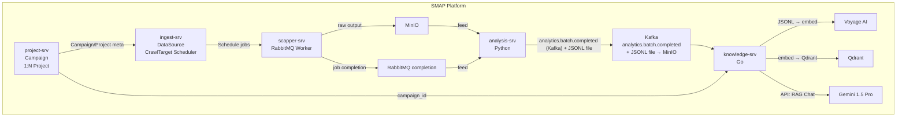
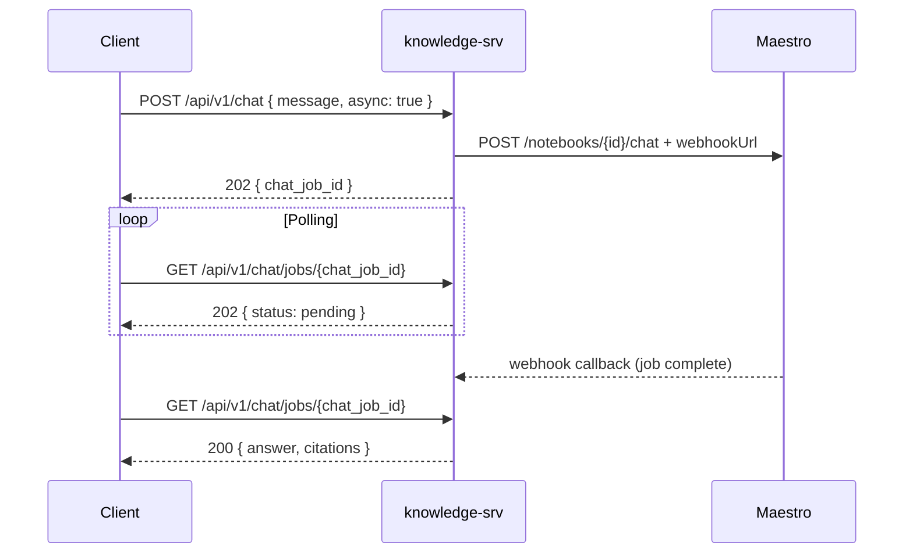
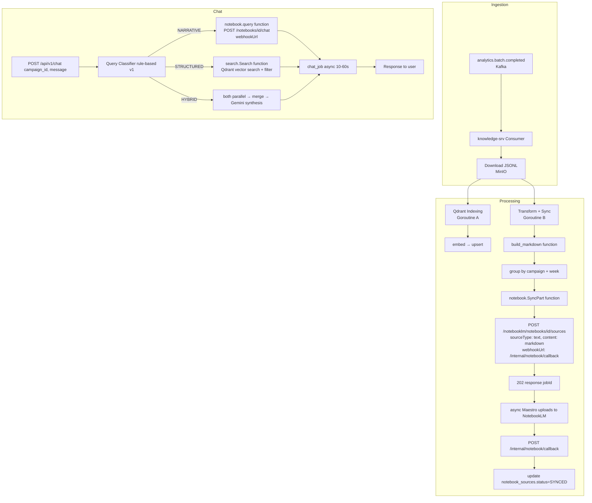

# Knowledge Service — Migration Proposal

# Hybrid RAG + NotebookLM Architecture

> Phiên bản: v2.0 | Ngày: 2026-03-23

---

## 1. Tổng quan hệ thống hiện tại

### 1.1 Sơ đồ luồng dữ liệu toàn hệ thống



### 1.2 Quan hệ Campaign — Project — Knowledge

```
Campaign (project-srv)
│  ID, Name, Status, StartDate, EndDate
│
└──► Project[] (1:N)
     │  ID, CampaignID, EntityType, EntityName, Brand, Status
     │
     └──► CrisisConfig (1:1)
          │  KeywordsTrigger, VolumeTrigger, SentimentTrigger, InfluencerTrigger
          │
          └──► DataSource[] (ingest-srv)
               └──► CrawlTarget[] → Crawl Jobs → AnalyticsPost[]
```

**Nguyên tắc quan trọng:**

- **Campaign** = đơn vị knowledge (1:1 với NotebookLM notebook). Chat API nhận `campaign_id`, resolve ra tất cả `project_id` thuộc campaign, search/query across toàn bộ.
- **Project** = đơn vị thu thập & phân tích. Data index vào Qdrant với `project_id` trong payload.
- **`AnalyticsPost` chỉ có `project_id`** — để group theo campaign cần lookup `project → campaign_id`.

### 1.3 Luồng Indexing hiện tại (chi tiết)

```
Kafka: analytics.batch.completed
  { batch_id, project_id, file_url: "s3://bucket/path.jsonl", record_count }
         │
         ▼
knowledge-srv consumer
         │
         ▼
MinIO download JSONL → []AnalyticsPost (đã qua 5-stage NLP)
         │
         ▼ parallel, max 10 goroutines
For each record:
  1. Validate (id, project_id, source_id, content ≥ 10 chars)
  2. Pre-filter (is_spam OR is_bot OR quality < 0.3 → skip)
  3. Dedup (by analytics_id OR content SHA256)
  4. Create tracking row (schema_knowledge.indexed_documents, status=PENDING)
  5. Voyage AI embed(content) — Redis cache by content_hash
  6. Qdrant upsert (collection: smap_analytics, point_id = analytics_id)
  7. Update status → INDEXED
  → DLQ nếu fail step 5 hoặc 6
```

### 1.4 Luồng Chat/RAG hiện tại

```
POST /api/v1/chat { campaign_id, conversation_id, message, filters }
  1. Validate message (3-2000 chars)
  2. Load/create conversation
  3. Load ≤20 recent messages (context window)
  4. Search:
     a. Redis cache check (by query hash)
     b. Resolve campaign_id → []project_id  ← cần gọi internal hoặc DB
     c. Voyage AI embed(query) — Redis cache by SHA256
     d. Qdrant search (filter: project_ids, MinScore=0.65, top 10)
     e. Post-filter + aggregate by sentiment/aspect/platform
  5. Build prompt:
     - System: tiếng Việt instructions
     - Context: [1]...[2]... max 500 chars/doc × 10 docs = ~5,000 chars
     - History: ≤20 messages
     - Token cap: 28,000
  6. Gemini 1.5 Pro → answer
  7. Extract citations → store conversation → return
```

---

## 2. Chẩn đoán vấn đề

### 2.1 Vấn đề embedding & search

| Vấn đề | Nguyên nhân | Hậu quả |
|--------|-------------|---------|
| Vector kém chất lượng | Voyage AI embed raw text mạng xã hội VN (viết tắt, emoji, Teencode) — không preprocessing phù hợp | "xu hướng tiêu cực về X" không match đúng posts |
| Context window cực hẹp | 500 chars × 10 = 5,000 chars cho toàn bộ context | Gemini thiếu thông tin để synthesis |
| Không có reranking | Top 10 cosine similarity đưa thẳng vào prompt | Noise cao, docs không thực sự liên quan |
| MinScore quá thấp (0.65) | Giữ không bỏ sót → nhận nhiều docs xa chủ đề | Gemini bị distract |
| Granularity mismatch | User hỏi tổng quan, Qdrant trả từng post riêng lẻ | Không trả lời được câu phân tích |

### 2.2 Vấn đề cốt lõi

```
User muốn:                    Qdrant làm được:              NotebookLM làm được:
"Tuần này brand bị      →     Tìm 10 posts gần với    →    Đọc toàn bộ 300 posts,
 phản ánh như thế nào?"        query về text               hiểu ngữ cảnh, trả lời
                               → Không synthesis            tổng quan có chiều sâu
```

---

## 3. Maestro API — Phân tích Contract

> File: `knowledge-srv/notebook.json` (OpenAPI 3.1.0, version 0.6.0)

### 3.1 Bản chất: Browser Automation, không phải Direct API

Maestro **không** gọi trực tiếp NotebookLM API. Nó dùng **browser automation** (Playwright/Puppeteer) để điều khiển trình duyệt thao tác với NotebookLM UI. Hệ quả:

- **Session** = 1 instance trình duyệt đang chạy
- **Mọi operation đều async** — trả về `jobId`, cần poll hoặc dùng webhook
- **Latency cao hơn** API thật: tạo notebook ~5-15s, upload source ~10-30s, chat ~10-60s
- **Session pool có giới hạn** — nếu pool đầy → 503

### 3.2 Tổng hợp tất cả endpoints

#### Sessions

| Method | Path | Purpose | Notes |
|--------|------|---------|-------|
| `POST` | `/notebooklm/sessions` | Tạo browser session | env: LOCAL\|BROWSERBASE |
| `GET` | `/notebooklm/sessions/{sessionId}` | Lấy session info | status: ready\|busy\|tearingDown |
| `DELETE` | `/notebooklm/sessions/{sessionId}` | Đóng session | |

#### Notebooks (đều cần `X-Session-Id` header)

| Method | Path | Purpose | Response | Async? |
|--------|------|---------|----------|--------|
| `POST` | `/notebooklm/notebooks` | Tạo notebook | `{ jobId }` | ✅ |
| `GET` | `/notebooklm/notebooks` | List notebooks | sync | ❌ |
| `POST` | `/notebooklm/notebooks/{id}/rename` | Đổi tên | `{ jobId }` | ✅ |
| `POST` | `/notebooklm/notebooks/{id}/sources` | Upload sources | `{ jobId }` | ✅ |
| `POST` | `/notebooklm/notebooks/{id}/chat` | Chat với notebook | `{ jobId }` | ✅ |
| `POST` | `/notebooklm/notebooks/{id}/podcast` | Tạo podcast | `{ jobId }` | ✅ |
| `POST` | `/notebooklm/notebooks/{id}/podcast/download` | Download audio | `{ jobId }` | ✅ |

#### Jobs

| Method | Path | Purpose |
|--------|------|---------|
| `GET` | `/notebooklm/jobs` | List jobs (filter by sessionId, pipelineId) |
| `GET` | `/notebooklm/jobs/{jobId}` | Poll status: queued→processing→completed/failed |

#### Pipelines

| Method | Path | Purpose |
|--------|------|---------|
| `POST` | `/notebooklm/pipelines` | Submit multi-step pipeline (array of `{action, input}`) |

### 3.3 Async Job Pattern

Tất cả mutating operations đều hoạt động theo mô hình:

```
Request → 202 Accepted { jobId, status: "queued", pollUrl }
                │
                ▼
         Poll GET /jobs/{jobId}
                │
         ┌──────┴──────┐
         │  processing  │  (tiếp tục poll)
         └──────┬──────┘
                │
         ┌──────┴──────────────┐
         │ completed           │ failed
         │ { result: {...} }   │ { error: {...} }
         └─────────────────────┘
```

**Webhook alternative** (được hỗ trợ bởi tất cả async ops):

```json
{
  "prompt": "...",
  "webhookUrl": "https://knowledge-srv/internal/notebook/callback",
  "webhookSecret": "hmac-secret"
}
```

Khi job hoàn thành, Maestro `POST` kết quả về `webhookUrl` với header `X-Maestro-Signature` (HMAC-SHA256). Knowledge-srv xác thực signature rồi xử lý.

### 3.4 Source Upload — Quan trọng: `sourceType: "text"`

```json
POST /notebooklm/notebooks/{id}/sources
{
  "sourceType": "text",
  "sources": [
    {
      "title": "VinFast Campaign - 2026-W12 - Part 1",
      "content": "# Báo cáo...\n## Bài đăng 1..."
    }
  ]
}
```

**Điểm mấu chốt**: Ta gửi **markdown text trực tiếp** trong request body, **không cần upload file lên MinIO trước** để NotebookLM đọc. MinIO vẫn dùng để backup/audit.

### 3.5 Chat

```json
POST /notebooklm/notebooks/{notebookId}/chat
{
  "prompt": "Tuần này brand VinFast bị nhìn nhận như thế nào trên mạng xã hội?",
  "webhookUrl": "https://knowledge-srv/internal/notebook/callback",
  "webhookSecret": "..."
}
→ 202 { jobId: "job_abc123" }

// Sau 10-60 giây, webhook callback:
POST /internal/notebook/callback
{
  "jobId": "job_abc123",
  "status": "completed",
  "result": {
    "answer": "Dựa trên các nguồn...",
    "citations": [...]
  }
}
```

### 3.6 Pipeline API

Có thể chain nhiều bước trong 1 request. Ứng dụng cho trường hợp campaign mới chưa có notebook:

```json
POST /notebooklm/pipelines
{
  "steps": [
    {
      "action": "create_notebook",
      "input": { "title": "SMAP | VinFast Campaign" }
    },
    {
      "action": "upload_sources",
      "input": {
        "sourceType": "text",
        "sources": [{ "title": "...", "content": "..." }]
      }
    }
  ],
  "webhookUrl": "..."
}
```

---

## 4. Kiến trúc đề xuất: Hybrid NotebookLM + Qdrant

### 4.1 Tổng quan

```
POST /api/v1/chat
       │
       ▼
┌─────────────────────┐
│   Query Classifier   │  (rule-based v1 → Gemini Flash v2)
└──────────┬──────────┘
           │
     ┌─────┴──────────────┐
 NARRATIVE │     STRUCTURED │
           ▼                ▼
┌──────────────────┐  ┌──────────────────────┐
│  NotebookLM      │  │  Qdrant search       │
│  (via Maestro)   │  │  + filters           │
│                  │  │        │             │
│  Đã là LLM, tự   │  │        ▼             │
│  synthesis từ    │  │  Gemini generation   │
│  toàn bộ docs    │  │        │             │
└────────┬─────────┘  └────────┬─────────────┘
         │                     │
         ▼                     ▼
  answer trực tiếp       answer trực tiếp
  (không qua Gemini)     (flow hiện tại)
```

> **Tại sao NARRATIVE không qua Gemini**: NotebookLM đã là LLM, đã đọc toàn bộ documents và tự synthesis answer. Feed result đó vào Gemini chỉ tốn thêm 2-5s trên latency đã 10-60s, không mang lại giá trị thêm. **NotebookLM answer = final answer.**

### 4.2 Phân loại query — chỉ 2 backend, không có HYBRID

| Query Intent | Ví dụ | Backend | LLM | Latency |
|--------------|-------|---------|-----|---------|
| **NARRATIVE** | "Brand bị đánh giá như thế nào?", "Xu hướng nổi bật tuần này?", "Điểm yếu được nhắc nhiều nhất?" | NotebookLM | NotebookLM (built-in) | 10-60s async |
| **STRUCTURED** | "Có bao nhiêu post rủi ro cao?", "Top bài viral?", "Tỷ lệ sentiment theo platform?", "Tại sao engagement giảm?", "So sánh tuần này vs tuần trước?" | Qdrant → Gemini | Gemini 1.5 Pro | 2-5s sync |

**Causal & Comparison queries** ("tại sao?", "so sánh?") → route **STRUCTURED**: Qdrant fetch đủ context → Gemini tổng hợp. Không cần NotebookLM vào đây — tránh chờ thêm 30-60s.

---

## 5. Chi tiết kỹ thuật

### 5.1 Session Manager

**Vấn đề**: Mỗi Maestro API call cần `X-Session-Id`. Session là browser instance, chi phí tạo mới cao (2-5s). Cần quản lý session lifecycle ở tầng knowledge-srv.

**Chiến lược**: **Single shared session + auto-recreate on failure**

```
knowledge-srv startup:
  1. POST /notebooklm/sessions → sessionId
  2. Lưu vào memory (+ Redis cho trường hợp multi-pod)
  3. Mọi Maestro call dùng chung session này

On session error (404, busy):
  1. Detect lỗi từ response
  2. DELETE session cũ (best effort)
  3. Tạo session mới
  4. Retry operation

Healthcheck: GET /notebooklm/sessions/{sessionId} mỗi 60s
```

**Database table** — track session state across pods:

```sql
CREATE TABLE maestro_sessions (
    id              UUID PRIMARY KEY DEFAULT gen_random_uuid(),
    session_id      VARCHAR(255) NOT NULL UNIQUE,
    status          VARCHAR(50) NOT NULL DEFAULT 'ready',
    -- ready | busy | tearingDown | dead
    pod_name        VARCHAR(255),       -- K8s pod name
    created_at      TIMESTAMPTZ DEFAULT NOW(),
    last_used_at    TIMESTAMPTZ,
    last_checked_at TIMESTAMPTZ
);
```

**Package mới** `pkg/maestro/`:

```
pkg/
  maestro/
    interface.go      # HTTP client interface gọi Maestro API
    types.go          # Request/Response types theo notebook.json
    maestro.go        # Implementation (http client wrapper)
    constant.go       # Constants, Endpoints
    errors.go         # Sentinel errors
```

> **Lưu ý**: Logic quản lý phiên làm việc (`session manager`), poll job và handle webhook sẽ được đóng gói vào domain business logic `internal/notebook/` theo chuẩn kiến trúc (clean architecture), vì chúng tương tác trực tiếp tới DB (`maestro_sessions`, `notebook_chat_jobs`).

---

### 5.2 Document Transform Pipeline

**Mục tiêu**: Chuyển `[]AnalyticsPost` (JSONL từ MinIO) → markdown text gửi thẳng cho Maestro.

**Trigger**: Song song với Qdrant indexing trong consumer. Sau khi JSONL download xong, chạy 2 goroutines:

- Goroutine A: indexing → Qdrant (flow hiện tại)
- Goroutine B: transform → queue for notebook sync

**Vấn đề `campaign_id`**: `AnalyticsPost` chỉ có `project_id`. Cần resolve `project_id → campaign_id`.

**Giải pháp**: Thêm `campaign_id` vào `BatchCompletedMessage` từ analysis-srv (vì analysis-srv nhận UAP đã có `campaign_id` trong `InsightMessage.project.campaign_id`).

> **TODO analysis-srv**: Thêm `campaign_id` vào `analytics.batch.completed` Kafka message.

**Grouping strategy**: Group theo `campaign_id + ISO week` (`2026-W12`), ≤50 posts/part.

**Output format** (markdown text được gửi trực tiếp cho Maestro `sourceType: "text"`):

```markdown
# SMAP Social Listening | Campaign: VinFast | Tuần: 2026-W12
> Platforms: TikTok, Facebook | Khoảng thời gian: 18/03 – 24/03/2026
> Tổng: 342 bài | Tiêu cực: 41% | Trung tính: 35% | Tích cực: 24%
> Risk cao: 12 bài | Cần chú ý: 8 bài

---

## [TikTok] Bài viết 1 — Tác động: CAO
- Tác giả: @nguyen_van_a (verified, 250K followers)
- Đăng lúc: 20/03/2026 14:30
- Lượt xem: 1,200,000 | Thích: 45,000 | Bình luận: 1,200 | Chia sẻ: 8,000
- Cảm xúc chung: TIÊU CỰC (điểm: 0.82, độ tin cậy: CAO)
- Khía cạnh:
  - Chất lượng sản phẩm: TIÊU CỰC (0.91) — "xe lỗi nhiều quá", "bảo hành mãi không xong"
  - Dịch vụ hậu mãi: TIÊU CỰC (0.75) — "nhân viên thờ ơ"
- Rủi ro: CAO | Cần xử lý: CÓ
- Từ khóa: VF8, lỗi xe, bảo hành, thất vọng
- Nội dung: [clean_text của bài viết — toàn bộ, không truncate]

---

## [Facebook] Bài viết 2 — Tác động: TRUNG BÌNH
...
```

**Lý do dùng tiếng Việt**: NotebookLM xử lý tiếng Việt tốt hơn khi cả source lẫn query cùng ngôn ngữ.

**Domain mới** `internal/transform/`:

```
internal/
  transform/
    usecase/
      build_markdown.go   # AnalyticsPost → markdown section
      batch_builder.go    # group by campaign + week, split ≤50 posts
    types.go              # TransformInput, TransformOutput, MarkdownPart
```

---

### 5.3 Notebook Sync Service

**Mục tiêu**: Upload markdown parts lên NotebookLM (via Maestro), track trạng thái sync.

**Flow chi tiết**:

```
[Consumer vừa xử lý 1 batch]
         │
         ▼
transform.BuildMarkdown([]AnalyticsPost, campaign_id, week)
  → []MarkdownPart { title, content, post_count }
         │
         ▼
For each part:
  1. Check notebook_sources DB:
     - Nếu SYNCED → skip (đã upload, không upload lại)
     - Nếu PENDING/FAILED → tiếp tục
  2. Create/insert row (status=PENDING)
  3. EnsureNotebook(campaign_id):
     - Lookup notebook_campaigns DB
     - Nếu chưa có → POST /notebooklm/notebooks + poll jobId
       → lưu notebook_id vào notebook_campaigns
  4. POST /notebooklm/notebooks/{id}/sources
     {
       sourceType: "text",
       sources: [{ title: part.title, content: part.content }],
       webhookUrl: "https://knowledge-srv/internal/notebook/callback",
       webhookSecret: "..."
     }
     → returns jobId
  5. Lưu jobId vào notebook_sources, status=UPLOADING
  6. (Async) Webhook callback nhận được:
     → Update notebook_sources.status = SYNCED / FAILED
```

**Database tables** (schema_knowledge):

```sql
-- 1 notebook per campaign (rolling per quarter)
CREATE TABLE notebook_campaigns (
    id              UUID PRIMARY KEY DEFAULT gen_random_uuid(),
    campaign_id     UUID NOT NULL,
    notebook_id     VARCHAR(255) NOT NULL,   -- Maestro notebook ID
    period_label    VARCHAR(20) NOT NULL,    -- "2026-Q1" (rolling quarters)
    status          VARCHAR(50) NOT NULL DEFAULT 'ACTIVE',
    -- ACTIVE | ARCHIVED
    last_synced_at  TIMESTAMPTZ,
    source_count    INT NOT NULL DEFAULT 0,
    created_at      TIMESTAMPTZ DEFAULT NOW(),
    updated_at      TIMESTAMPTZ DEFAULT NOW(),
    UNIQUE (campaign_id, period_label)
);

-- Track từng markdown part đã upload
CREATE TABLE notebook_sources (
    id              UUID PRIMARY KEY DEFAULT gen_random_uuid(),
    campaign_id     UUID NOT NULL,
    notebook_id     VARCHAR(255) NOT NULL,
    week_label      VARCHAR(10) NOT NULL,   -- "2026-W12"
    part_number     INT NOT NULL DEFAULT 1,
    title           TEXT NOT NULL,
    post_count      INT NOT NULL DEFAULT 0,
    maestro_job_id  VARCHAR(255),           -- job_id từ Maestro upload
    status          VARCHAR(50) NOT NULL DEFAULT 'PENDING',
    -- PENDING → UPLOADING → SYNCED / FAILED
    retry_count     INT NOT NULL DEFAULT 0,
    synced_at       TIMESTAMPTZ,
    error_message   TEXT,
    created_at      TIMESTAMPTZ DEFAULT NOW(),
    UNIQUE (campaign_id, week_label, part_number)
);

-- Track Maestro sessions (cross-pod)
CREATE TABLE maestro_sessions (
    id              UUID PRIMARY KEY DEFAULT gen_random_uuid(),
    session_id      VARCHAR(255) NOT NULL UNIQUE,
    status          VARCHAR(50) NOT NULL DEFAULT 'ready',
    pod_name        VARCHAR(255),
    created_at      TIMESTAMPTZ DEFAULT NOW(),
    last_used_at    TIMESTAMPTZ,
    last_checked_at TIMESTAMPTZ
);
```

**Retention strategy**: Theo quarter (`2026-Q1`, `2026-Q2`...).
Khi qua quarter mới:

1. Archive notebook cũ (update status=ARCHIVED)
2. Tạo notebook mới cho quarter mới
3. Dữ liệu cũ vẫn trong Qdrant, chỉ NotebookLM là rolling

**Domain mới** `internal/notebook/`:

```
internal/
  notebook/
    usecase/
      ensure.go    # EnsureNotebook: lookup or create notebook for campaign+period
      sync.go      # SyncPart: upload 1 markdown part → Maestro
      query.go     # QueryNotebook: chat với notebook, poll result
      retry.go     # RetryFailed: retry FAILED sources
    repository/
      postgre/
        campaign_repo.go
        source_repo.go
    types.go
    interface.go
    errors.go
```

---

### 5.4 Webhook Handler

Maestro gọi callback về knowledge-srv khi job hoàn thành. Cần expose 1 internal endpoint.

**Endpoint mới** (internal, không qua auth middleware), được quản lý bởi `internal/notebook/delivery/http/handlers.go`:

```
POST /internal/notebook/callback
Headers: X-Maestro-Signature: sha256=<hmac>
Body: {
  "jobId": "job_abc123",
  "action": "upload_sources" | "create_notebook" | "chat" | ...,
  "status": "completed" | "failed",
  "result": { ... },
  "error": { ... }
}
```

**Xử lý**:

```
1. Verify HMAC-SHA256 signature (dùng webhookSecret từ config)
2. Route theo action chuyển tiếp tới usecase của `internal/notebook`:
   - "upload_sources" → update notebook_sources by maestro_job_id
     - completed → status=SYNCED, synced_at=now
     - failed → status=FAILED, error_message
   - "create_notebook" → update notebook_campaigns
     - completed → lưu notebook_id
   - "chat" → resolve pending chat request
     - completed → update notebook_chat_jobs & trả answer về cho user
     - failed → fallback về Qdrant
```

---

### 5.5 Query Router + Intent Classifier

**Vị trí**: `internal/chat/usecase/router.go`, được gọi trước bước Search.

```go
type QueryIntent string

const (
    IntentNarrative  QueryIntent = "NARRATIVE"   // → NotebookLM
    IntentStructured QueryIntent = "STRUCTURED"  // → Qdrant
    IntentHybrid     QueryIntent = "HYBRID"      // → cả hai, merge
)

type QueryRoute struct {
    Intent        QueryIntent
    UseNotebook   bool
    UseQdrant     bool
    QdrantFilters *SearchFilters
}
```

**v1 — Rule-based** (triển khai ngay, không cần LLM call thêm):

```go
// → NARRATIVE
narrativeSignals = []string{
    "xu hướng", "đánh giá", "nhìn nhận", "tổng quan", "phân tích",
    "điểm mạnh", "điểm yếu", "được nói đến", "người dùng nghĩ",
    "ý kiến", "phản ứng", "cảm nhận", "dư luận",
}

// → STRUCTURED
structuredSignals = []string{
    "bao nhiêu", "đếm", "thống kê", "top", "danh sách",
    "nhiều nhất", "ít nhất", "phần trăm", "tỷ lệ", "số lượng",
}

// → HYBRID (ưu tiên check trước)
hybridSignals = []string{
    "tại sao", "vì sao", "nguyên nhân", "lý do", "so sánh",
    "khác gì", "thay đổi", "giảm", "tăng",
}
```

**v2 — Gemini Flash classify** (nâng cấp sau, khi có dữ liệu thực để calibrate):

```go
// Gọi Gemini với prompt nhỏ + structured output
// ~100ms, ~0.001$/call — chấp nhận được
```

---

### 5.6 Chat Flow mới (với Notebook path)

**Vấn đề latency**: NotebookLM chat qua browser automation mất 10-60s. Không thể block HTTP request của user.

**Giải pháp**: **Async chat với long-polling hoặc SSE**



1. Client gửi chat async, knowledge-srv forward sang Maestro, trả về job_id.
2. Client polling tiến trình.
3. Khi Maestro xong, knowledge-srv nhận webhook.
4. Client lấy kết quả.

**Database table** — track chat jobs:

```sql
CREATE TABLE notebook_chat_jobs (
    id              UUID PRIMARY KEY DEFAULT gen_random_uuid(),
    conversation_id UUID NOT NULL,
    campaign_id     UUID NOT NULL,
    user_message    TEXT NOT NULL,
    maestro_job_id  VARCHAR(255),
    status          VARCHAR(50) NOT NULL DEFAULT 'PENDING',
    -- PENDING → PROCESSING → COMPLETED / FAILED / FALLBACK
    notebook_answer TEXT,
    fallback_used   BOOLEAN NOT NULL DEFAULT false,
    created_at      TIMESTAMPTZ DEFAULT NOW(),
    completed_at    TIMESTAMPTZ,
    expires_at      TIMESTAMPTZ DEFAULT NOW() + INTERVAL '10 minutes'
);
```

**New API endpoints**:

```
POST /api/v1/chat
  → Nếu intent=NARRATIVE và notebook available:
      202 { chat_job_id, estimated_wait_seconds: 30 }
  → Nếu intent=STRUCTURED hoặc notebook unavailable:
      200 { answer, citations, ... }  (sync như cũ)

GET /api/v1/chat/jobs/{chat_job_id}
  → 202 { status: "pending" | "processing" }
  → 200 { answer, citations, backend: "notebook", ... }
  → 200 { answer, citations, backend: "qdrant_fallback", ... }
```

---

### 5.7 Response Merger (HYBRID intent)

```
[Parallel execution]
  NotebookLM answer ──────────┐
  Qdrant top results ──────────┤
                               ▼
                    Gemini synthesis prompt:
                    "Bạn là analyst, tổng hợp:
                     1. Phân tích tổng quan: [notebook_answer]
                     2. Số liệu cụ thể: [qdrant top 5]
                     Trả lời câu hỏi: [user_query]"
```

---

## 6. Migration Plan (Phased)

### Phase 1 — Transform Pipeline + Maestro Client (Tuần 1–2)

**Deliverables**:

- [ ] Package `pkg/maestro/` — HTTP client wrapper với tất cả endpoints theo chuẩn `pkg_convention`
- [ ] Domain `internal/transform/` — AnalyticsPost → markdown converter
- [ ] Batch builder: group by campaign_id + week, split ≤50 posts/part
- [ ] DB migration: `migrations/008_create_notebook_tables.sql` (bảng `notebook_campaigns`, `notebook_sources`, `maestro_sessions`)
- [ ] Config: thêm Maestro và Notebook section vào `knowledge-config.yaml`

**Không break gì hiện tại** — consumer vẫn chạy bình thường, transform chạy song song.

**Blocker**: analysis-srv cần thêm `campaign_id` vào `analytics.batch.completed` message.

---

### Phase 2 — Notebook Sync + Webhook (Tuần 3–4)

**Deliverables**:

- [ ] Domain `internal/notebook/` — Session lifecycle (manager), EnsureNotebook, SyncPart, RetryFailed
- [ ] `POST /internal/notebook/callback` webhook handler + HMAC verification
- [ ] Sync trigger: sau khi consumer xử lý batch, async trigger sync goroutine
- [ ] Retry scheduler: mỗi 30 phút retry FAILED sources (max 3 lần)
- [ ] Feature flag `NOTEBOOK_ENABLED=false` (mặc định tắt)
- [ ] Dashboard: log sync status để monitor

---

### Phase 3 — Async Chat + Query Router (Tuần 5–6)

**Deliverables**:

- [ ] `internal/notebook/usecase/query.go` — chat với notebook, webhook pattern
- [ ] DB: table `notebook_chat_jobs`
- [ ] `GET /api/v1/chat/jobs/{id}` — polling endpoint
- [ ] Query Router (rule-based v1)
- [ ] Fallback logic: NotebookLM timeout (30s) → Qdrant
- [ ] Response Merger cho HYBRID intent
- [ ] A/B test: so sánh answer quality

---

### Phase 4 — RAG Improvement (song song, độc lập)

Cải thiện Qdrant path không liên quan đến NotebookLM:

**4a. HyDE** (Hypothetical Document Embeddings):

```
User query → Gemini Flash sinh "đoạn trả lời giả định" → embed đoạn đó
→ Search Qdrant bằng vector của "câu trả lời" thay vì câu hỏi
→ Semantic match tốt hơn nhiều với content mạng xã hội
```

**4b. Quality threshold tốt hơn**:

- MinScore: 0.65 → 0.72
- Max docs: 10 → 7 (ít hơn nhưng relevant hơn)

**4c. Better content cho Qdrant** (khi index):

- Thay vì embed raw content → embed `clean_text` (đã normalize bởi analysis-srv)
- Tạo "enriched text" cho embedding: `[sentiment] [aspects] [keywords]: [content]`

---

## 7. Dependency Map

```
analysis-srv fix
(thêm campaign_id)
       │
       ▼
Phase 1 ──────────────────────────────────────────► Phase 4
(Maestro client + Transform)                        (RAG improvement)
       │                                             (Độc lập)
       ▼
Phase 2
(Notebook Sync + Webhook)
       │
       ▼
Phase 3
(Async Chat + Router)
```

---

## 8. Full Architecture Diagram (Target State)



---

## 9. Config thay đổi (knowledge-config.yaml)

```yaml
Maestro:
  base_url: "http://maestro-srv:3000"       # internal K8s service
  api_key: "..."
  session_env: "LOCAL"                       # LOCAL | BROWSERBASE
  session_health_interval_seconds: 60
  job_poll_interval_ms: 2000
  job_poll_max_attempts: 30                  # 30 × 2s = 60s timeout
  webhook_secret: "..."                      # HMAC secret
  webhook_callback_url: "http://knowledge-api/internal/notebook/callback"

Notebook:
  enabled: false                             # feature flag, bật per-env
  max_posts_per_part: 50
  retention_quarters: 2                      # giữ 2 quarters = 6 tháng
  sync_retry_interval_minutes: 30
  sync_max_retries: 3
  chat_timeout_seconds: 45                   # timeout trước khi fallback Qdrant

Router:
  default_backend: "qdrant"                  # "qdrant" | "notebook" | "hybrid"
  notebook_fallback_enabled: true
  intent_classifier: "rules"                 # "rules" | "gemini_flash"
```

---

## 10. API thay đổi

### Backward compatible — không break clients hiện tại

```json
// POST /api/v1/chat response — thêm optional fields
{
  "conversation_id": "...",
  "answer": "...",
  "citations": [...],
  "suggestions": [...],
  "search_metadata": {
    "cache_hit": false,
    "processing_time_ms": 1200,
    "backend": "hybrid",           // NEW: "qdrant" | "notebook" | "qdrant_fallback"
    "notebook_available": true,    // NEW
    "query_intent": "NARRATIVE",   // NEW
    "sync_lag_hours": 0.5          // NEW: thời gian lag từ lúc crawl đến sync notebook
  }
}
```

### Endpoints mới

```
// Async chat polling (chỉ cho NARRATIVE queries)
GET  /api/v1/chat/jobs/{chat_job_id}
→ 202 { status: "pending" | "processing", estimated_wait_seconds: 25 }
→ 200 { answer, citations, backend: "notebook" | "qdrant_fallback" }

// Internal webhook receiver
POST /internal/notebook/callback
Headers: X-Maestro-Signature: sha256=<hmac>

// Admin: Notebook sync status
GET  /api/v1/campaigns/{id}/notebook/status
→ { notebook_id, last_synced_at, pending_parts, failed_parts, ... }

// Admin: Force re-sync
POST /api/v1/campaigns/{id}/notebook/sync
```

---

## 11. Trade-offs & Risks

| Risk | Mức độ | Mitigation |
|------|--------|------------|
| Maestro browser automation bị break (Google update NotebookLM UI) | HIGH | Qdrant RAG luôn là fallback. Feature flag để disable nhanh. Monitor webhook error rate. |
| Chat latency cao (10-60s qua browser) | HIGH | Async pattern + polling endpoint. Timeout 45s → fallback Qdrant. Client hiển thị "đang phân tích..." |
| Session pool đầy (503 từ Maestro) | MEDIUM | Exponential backoff + retry. Không block indexing flow. |
| NotebookLM giới hạn số sources per notebook | MEDIUM | Rolling quarters, mỗi quarter tối đa ~12 tuần × N parts. Theo dõi `source_count`. |
| `campaign_id` thiếu trong `AnalyticsPost` | MEDIUM | **Cần fix analysis-srv** thêm `campaign_id` vào `BatchCompletedMessage` trước Phase 1. |
| NotebookLM chất lượng tiếng Việt không đảm bảo | MEDIUM | Test thực tế trước khi bật `NOTEBOOK_ENABLED=true` cho production. |
| Webhook callback không đến (network issue) | LOW | Fallback poll `GET /jobs/{jobId}` sau timeout. |
| Sync lag (vài phút sau khi crawl) | LOW | Acceptable với social listening usecase. |

---

## 12. Breaking change cần fix trước Phase 1

**analysis-srv**: Thêm `campaign_id` vào Kafka message:

```python
# internal/analytics/publisher.py
@dataclass
class BatchCompletedMessage:
    batch_id: str
    project_id: str
    campaign_id: str   # ← THÊM MỚI
    file_url: str
    record_count: int
    completed_at: str
```

```go
// knowledge-srv: internal/indexing/delivery/kafka/type.go
type BatchCompletedMessage struct {
    BatchID     string    `json:"batch_id"`
    ProjectID   string    `json:"project_id"`
    CampaignID  string    `json:"campaign_id"`   // ← THÊM MỚI
    FileURL     string    `json:"file_url"`
    RecordCount int       `json:"record_count"`
    CompletedAt time.Time `json:"completed_at"`
}
```

Nếu chưa fix được analysis-srv ngay, fallback: knowledge-srv tự resolve `project_id → campaign_id` bằng cách gọi project-srv internal API (cached trong Redis, TTL 1h).
